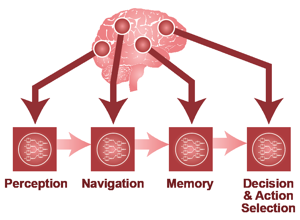

# 01 Why Map the Brain
Technical Training: Nanoscale Connectomics

---

## Session outcomes (60 minutes)
- Translate a broad neuroscience goal into one testable connectomics hypothesis.
- Define measurable structural outputs and one defensible null model.
- State one explicit non-claim to prevent over-interpretation.

---

## Pedagogical arc
- Hook: why map structure at all?
- Model: question -> metric -> null -> boundary.
- Practice: learners draft and critique hypothesis briefs.
- Check: rubric-aligned exit ticket.

---

## Visual opener: the motivation question

- Prompt: what specific scientific uncertainty is this figure trying to reduce?

---

## Framing the evidence problem

- Structure is evidence of organization and constraints, not direct proof of dynamics.

---

## Reverse-engineering analogy and its limit

- Good analogy for constraints.
- Bad analogy if used to claim full mechanistic causality from structure alone.

---

## What structure can support (high-confidence)
- Motif enrichment/depletion hypotheses.
- Cell-type targeting bias quantification.
- Path-length and convergence/divergence constraints.
- Candidate priors for mechanistic or AI models.

---

## What structure cannot prove alone
- Real-time state trajectories.
- Causal dynamics without perturbation/physiology.
- Full behavioral mechanism across contexts.

---

## Workflow: question to claim
Biological question -> measurable endpoint -> dataset suitability -> null model -> interpretation boundary

---

## Example A: recurrent microcircuit hypothesis
- Question: are triadic motifs enriched above local random expectation?
- Endpoint: motif counts normalized by degree/spatial constraints.
- Null: degree-preserving + distance-aware rewiring.
- Non-claim: enrichment does not prove online computation.

---

## Example B: targeting specificity hypothesis
- Question: does class X preferentially target compartment Y?
- Endpoint: synapse-density ratio by compartment with uncertainty.
- Null: shuffled target labels preserving volume occupancy.
- Non-claim: specificity does not imply causal functional role.

---

## Evidence quality gates before interpretation
- Reconstruction completeness threshold tied to claim type.
- Annotation agreement target for key labels.
- Error budget explicitly documented.
- Region/species/age boundary explicitly documented.

---

## Common failure modes (teach explicitly)
- Claim inflation from descriptive results.
- Metric mismatch to hypothesis.
- Dataset scale mismatch to biological question.
- Post-hoc null-model selection.

---

## Instructor discussion move (Think-Pair-Share, 6 min)
- Think: rewrite one overclaim into a bounded claim.
- Pair: identify missing metric/null information.
- Share: vote on strongest boundary statement.

---

## In-class activity (12 min)
Draft one hypothesis brief containing:
1. question,
2. endpoint,
3. null model,
4. one confound,
5. one explicit non-claim.

---

## Formative check rubric
- Pass: all five brief components present and coherent.
- Strong: endpoint and null align tightly to question.
- Flag: claims exceed available evidence class.

---

## Exit ticket (3 min)
Write one sentence each:
- "Our data can support..."
- "Our data cannot support..."

---

## Figure attribution and references
- Visual sources: internal outreach + module12 lesson assets (historical context).
- Pair with journal-club readings on structure-function boundaries.

---

## External paper figure slots (add in final teaching run)
- Dense reconstruction figure (motif/cell-type evidence context).
- Multimodal connectomics figure (structure-to-function boundary context).
- Connectome-analysis methodology figure (null-model and inference limits).
