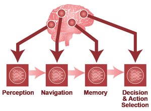

<!-- _class: title nanoscale -->

Human cortex · H01 Object segmentation over electron microscopy

H01 release · Lichtman Lab / Harvard &amp; Connectomics at Google · CC BY 4.0 Shapson-Coe et al. (2024) · doi:10.1126/science.adk4858

<!-- _paginate: skip -->

Technical Course · Unit 01

# Why Map the Brain

What a synapse-resolution wiring diagram can and cannot tell you, and how to turn a broad brain question into a measurable connectomics study.

<!--
Instructor script: "This unit is deliberately not about microscopes. It is about the reasoning step that happens before anyone buys a microscope — deciding what claim the data will be asked to support. Most failed connectomics projects skip it."
-->

---

## Session outcomes (60 minutes)
- Translate a broad neuroscience goal into one testable connectomics hypothesis.
- Define measurable structural outputs and one defensible null model.
- State one explicit non-claim to prevent over-interpretation.

<!--
Read the three outcomes aloud, then name the one that matters most: sorting a claim by what structure can support. The unit page says it plainly — it is the outcome most often failed. Everything in this session is practice for the non-claim in the third bullet.
-->

---

## Pedagogical arc
- Hook: why map structure at all?
- Model: question -> metric -> null -> boundary.
- Practice: learners draft and critique hypothesis briefs.
- Check: rubric-aligned exit ticket.

---

<!-- _class: figure -->

## Visual opener: the motivation question

What specific scientific uncertainty is this figure trying to reduce?

Source: neuroAI source deck (2021 techtalk), Techtalk S10. Historical/context visual.

<!--
Instructor script: "This is a motivating question, asked before any instrument is chosen. Before we go further, turn it into something fundable: what is the measurable structural endpoint, what is the null model, and what is the non-claim?"
Collect two or three answers. Each one should imply a different measurement — point that out. This is a framing device, not evidence.
-->

---

<!-- _class: figure -->

## Framing the evidence problem

Structure is evidence of organization and constraints, not direct proof of dynamics.

Source: neuroAI source deck (2021 techtalk), Techtalk S11. Historical/context visual.

<!--
Instructor script: "What counts as brain data? Hold this against the resolution table from the unit: light microscopy tops out around 200–250 nm. An unmyelinated axon in neuropil is 80–300 nm, a spine neck 50–200 nm, a synaptic cleft about 20 nm."
The point to land: at 250 nm, two membranes 20 nm apart are one blur. Light microscopy can show that two arbors overlap in space; it cannot show that they are connected. That is the whole reason the field tolerates the cost of EM.
-->

---

<!-- _class: figure -->

## Reverse-engineering analogy and its limit

A good analogy for constraints. A bad one if it is used to claim full mechanistic causality from structure alone.

Source: neuroAI source deck (2021 techtalk), Techtalk S12. Historical/context visual.

<!--
Instructor script: "A wiring diagram is a constraint on the space of possible dynamics, not a simulation. Any 'this circuit computes X' reading of this analogy is a Bin C claim wearing Bin A clothing."
If the room has not met the bins yet, preview them: A = structure alone suffices; B = structure plus one declared assumption; C = structure cannot establish this. The next two slides fill them in.
-->

---

## What structure can support (high-confidence)
- Motif enrichment/depletion hypotheses.
- Cell-type targeting bias quantification.
- Path-length and convergence/divergence constraints.
- Candidate priors for mechanistic or AI models.

<!--
These are Bin A claims — each is a census or a comparison. Give the unit's concrete examples: "Neuron X makes 42 synapses onto neuron Y"; "type A targets proximal dendrites of type B"; "reciprocal pairs occur 4x more often than a degree-preserving null predicts"; "this projection is absent, at a stated detection sensitivity."
Then the Bin B middle ground: "this synapse is excitatory" needs the assumption that asymmetric morphology predicts glutamatergic transmission. Rule: name the assumption in the same sentence. "Putatively excitatory (asymmetric morphology)" costs four words.
-->

---

## What structure cannot prove alone
- Real-time state trajectories.
- Causal dynamics without perturbation/physiology.
- Full behavioral mechanism across contexts.

<!--
Bin C. "This circuit computes X during behavior Y" needs physiology. "This synapse is potentiated" needs a functional or molecular measure. "This wiring causes the decision" needs perturbation. Neuromodulatory state is largely invisible in a standard EM volume.
Instructor script: "The most common failure of connectomics writing is a Bin C sentence in the abstract supported by a Bin A measurement in the results."
-->

---

## Workflow: question to claim
Biological question -> measurable endpoint -> dataset suitability -> null model -> interpretation boundary

<!--
Walk the unit's worked repair. Version 0: "We will use connectomics to understand how the cortex implements predictive coding" — Bin C, no endpoint, unfalsifiable.
Move 1, structural signature: feedback axons from higher visual areas target a different dendritic compartment of L2/3 pyramidal cells than feedforward inputs.
Move 2, measurement with units: input synapses per source class per compartment per cell, binned by path distance.
Move 3, null: sources distributed in proportion to available postsynaptic surface area — distal synapses are the expected result, not evidence.
Move 4, non-claim: the data constrain where feedback arrives; they do not show it carries prediction error, and they do not establish sign.
-->

---

## Example A: recurrent microcircuit hypothesis
- Question: are triadic motifs enriched above local random expectation?
- Endpoint: motif counts normalized by degree/spatial constraints.
- Null: degree-preserving + distance-aware rewiring.
- Non-claim: enrichment does not prove online computation.

<!--
Flag the trap this example carries, from unit §4: merge errors do not add noise symmetrically to motif counts. A single merge fuses two neurons' partner lists and manufactures triangles and reciprocal pairs far above the error rate itself. Motif analysis on unproofread segmentation is biased in a predictable direction — toward the interesting answer. Unit 09 returns to this.
-->

---

## Example B: targeting specificity hypothesis
- Question: does class X preferentially target compartment Y?
- Endpoint: synapse-density ratio by compartment with uncertainty.
- Null: shuffled target labels preserving volume occupancy.
- Non-claim: specificity does not imply causal functional role.

<!--
Point out that the endpoint is a ratio. Ratios between comparably reconstructed populations quietly control for a great deal of reconstruction bias; absolute counts are sensitive to completeness. Experienced people reach for the ratio automatically — say so, because nobody else will.
-->

---

## Evidence quality gates before interpretation
- Reconstruction completeness threshold tied to claim type.
- Annotation agreement target for key labels.
- Error budget explicitly documented.
- Region/species/age boundary explicitly documented.

<!--
Match the claim to the reconstruction state (unit §4). "Cell X synapses onto Y" needs both partners proofread through the synapse — otherwise a merge invents the connection. "Cell X has n inputs" needs the full dendritic arbor closed — split errors make n an undercount of unknown size. "Type A prefers B over C" needs both populations proofread to comparable completeness. "This projection is absent" needs a stated detection sensitivity.
-->

---

## Common failure modes (teach explicitly)
- Claim inflation from descriptive results.
- Metric mismatch to hypothesis.
- Dataset scale mismatch to biological question.
- Post-hoc null-model selection.

<!--
Recovery moves from the unit page: if the analysis is "figured out once we have the data", write the figure caption for the main result now, with fake numbers — if you cannot write it, the experiment is not specified. Whole-graph summaries (mean path length, global clustering) are nearly useless for a local microcircuit claim. Neurons cut by the volume edge have truncated arbors. Populations proofread differently are confounded with effort.
-->

---

## Instructor discussion move (Think-Pair-Share, 6 min)
- Think: rewrite one overclaim into a bounded claim.
- Pair: identify missing metric/null information.
- Share: vote on strongest boundary statement.

<!--
Seed overclaims from the unit's check-yourself: "This interneuron inhibits pyramidal cell firing" (Bin B verging on C — a GABAergic synapse can be depolarizing; write "putatively inhibitory"). "Kenyon cell input is random with respect to glomerular identity" (Bin A only if "random" is defined against a stated null and restricted to the reconstructed population).
-->

---

## In-class activity (12 min)
Draft one hypothesis brief containing:
1. question,
2. endpoint,
3. null model,
4. one confound,
5. one explicit non-claim.

<!--
Instructor script: "Produce it in this order. Do not skip to the method." Circulate and check step 5 first. The single best predictor of a weak brief is that the non-claim is empty or vague: if you cannot name a sentence you refuse to write, you have not found the boundary of your evidence.
-->

---

## Formative check rubric
- Pass: all five brief components present and coherent.
- Strong: endpoint and null align tightly to question.
- Flag: claims exceed available evidence class.

<!--
The full lab rubric on the unit page scores falsifiability, measurement, null model, scope discipline and feasibility. For "strong" on the null: it preserves the nuisance structure that matters — degree, distance, cell-type composition — not just "compare to random".
-->

---

## Exit ticket (3 min)
Write one sentence each:
- "Our data can support..."
- "Our data cannot support..."

---

## Figure attribution and reading
- Figures in this deck: 2021 neuroAI techtalk (historical/context visuals); each slide carries its own source line.
- White et al. (1986), *Phil Trans R Soc B*, doi:10.1098/rstb.1986.0056 — the first complete nervous system.
- Dorkenwald et al. (2024), *Nature*, doi:10.1038/s41586-024-07558-y — FlyWire whole adult brain.
- MICrONS Consortium (2025), *Nature*, doi:10.1038/s41586-025-08790-w — structure and function in the same neurons.
- Shapson-Coe et al. (2024), *Science*, doi:10.1126/science.adk4858 — H01 human cortex.

<!--
These are the four anchors from unit §5, so "connectomics is useful" is a claim learners can defend with examples rather than enthusiasm. Note what the useful results have in common: each is a census or a comparison, not an assertion about computation. C. elegans's lasting lesson is negative and useful — the complete 302-neuron wiring diagram did not immediately yield an understanding of behavior.
-->
