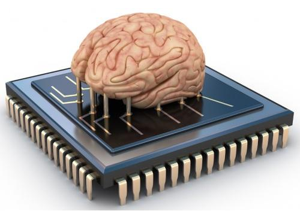
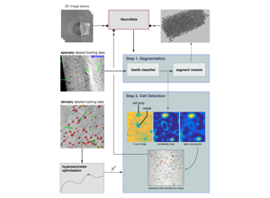

# 02 Brain Data Across Scales
Technical Training: Nanoscale Connectomics

---

## Session outcomes (60 minutes)
- Match biological questions to minimal sufficient spatial/temporal scale.
- Choose representation transitions without losing inference-critical detail.
- Produce a scale-and-compute justification for one analysis plan.

---

## Pedagogical arc
- Concept map: scale as an inference constraint.
- Modeling: question -> data product -> representation -> compute budget.
- Practice: learner selects scale stack for a case study.
- Check: defend tradeoffs under critique.

---

## Why this matters
- Scale mismatch is a major source of invalid conclusions.
- Resolution, coverage, and compute are coupled design variables.
- "More data" does not fix wrong scale selection.

---

## Visual context: multi-scale framing

- Instructor cue: ask what is visible here and what is fundamentally unobservable at this scale.

---

## Visual context: analysis scale transition

- Distinguish acquisition scale from analysis target scale.

---

## Visual context: representational conversion risk

- Volume -> segmentation -> skeleton/mesh -> graph can remove critical geometry.

---

## Scale-selection framework
1. State estimand (what you will measure).
2. Determine smallest scale that resolves that estimand.
3. Verify coverage supports statistical claims.
4. Define acceptable uncertainty due to downsampling/registration.

---

## Representation tradeoffs
- Raw volume: maximal fidelity, expensive queries.
- Segmentation: workable objects, boundary errors matter.
- Skeleton: topology-focused, diameter context reduced.
- Graph: fast analytics, spatial nuance largely removed.

---

## Registration and uncertainty propagation
- Report transform model and residuals.
- Track uncertainty by region, not only global means.
- Carry registration confidence into downstream confidence intervals.

---

## Compute realism for scale planning
- Storage and IO growth are nonlinear with resolution/coverage.
- Query latency determines practical iteration speed.
- Budgeting is part of scientific method feasibility.

---

## Misconceptions to correct explicitly
- "Higher resolution always better." 
- "Graph conversion is lossless enough for any question."
- "Registration error averages out automatically."

---

## Think-Pair-Share (8 min)
Prompt: choose one hypothesis and argue for the *minimum* sufficient scale.
- Think: write one scale choice and one risk.
- Pair: challenge each other's coverage assumptions.
- Share: class votes on most defensible tradeoff.

---

## In-class activity
Create a one-page scale plan:
- question,
- estimand,
- acquisition scale,
- analysis representation,
- compute/storage estimate,
- boundary statement.

---

## Rubric checkpoint
- Pass: scale and representation choices are consistent with estimand.
- Strong: explicit uncertainty and compute tradeoff documented.
- Flag: claims exceed observable detail at chosen scale.

---

## External paper figure slots (add in final teaching run)
- Kasthuri et al. 2015 (dense microcircuit reconstruction) figure on scale and completeness.
- MICrONS consortium overview figure on multimodal scaling.
- H01/human cortex connectomics figure on data scale and processing implications.

---

## Bridge
Next unit: EM prep and imaging decisions that set artifact and quality limits.
