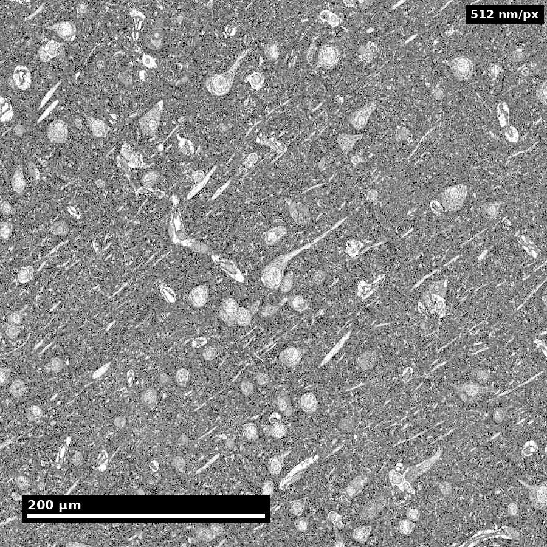
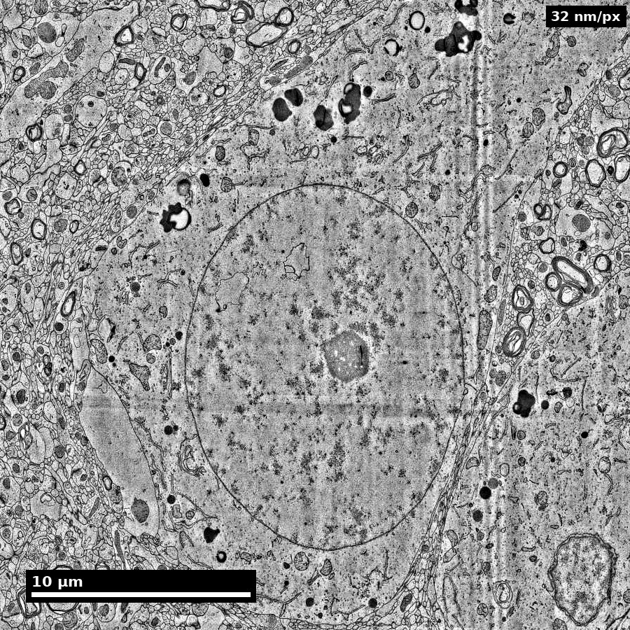
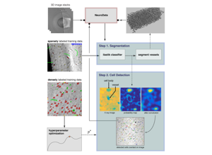

<!-- _class: title -->
<!-- _paginate: skip -->

Technical Course · Unit 02

# Brain Data Across Scales

Almost every practical connectomics decision is a scale decision in disguise.

<!--
Instructor script: "'Should we use SBEM or ssTEM?' is a scale decision. 'Can we answer this with the existing public dataset?' is a scale decision. 'Why doesn't our tractography match the EM?' is a scale decision that was made badly, earlier."
-->

---

## Session outcomes (60 minutes)
- Match biological questions to minimal sufficient spatial/temporal scale.
- Choose representation transitions without losing inference-critical detail.
- Produce a scale-and-compute justification for one analysis plan.

---

## Pedagogical arc
- Concept map: scale as an inference constraint.
- Modeling: question -> data product -> representation -> compute budget.
- Practice: learner selects scale stack for a case study.
- Check: defend tradeoffs under critique.

---

## Why this matters
- Scale mismatch is a major source of invalid conclusions.
- Resolution, coverage, and compute are coupled design variables.
- "More data" does not fix wrong scale selection.

<!--
Separate the three scales practitioners conflate. Acquisition scale: the voxel size your instrument produces. Reconstruction scale: the smallest object you can reliably segment — always coarser; at 4 x 4 x 40 nm you can see a 20 nm cleft but reliably segment neurites down to roughly 50–100 nm. Analysis scale: the unit your conclusions are about.
Decision rule: choose the coarsest acquisition scale whose reconstruction scale still resolves every object your analysis depends on. Not the finest you can afford — the coarsest that works.
-->

---

## One sample, four scales

   

Whole section (~4 mm wedge) → ≈460 µm cell field → ≈29 µm single neuron → ≈3.6 µm at native 4 nm. Same tissue throughout.

Source: H01 release (Lichtman Lab, Harvard; Connectomics at Google), CC BY 4.0 · Shapson-Coe et al. 2024, doi:10.1126/science.adk4858 · site render.

<!--
Instructor script: "Each panel is roughly four times closer than the last, and it is the same piece of human temporal cortex throughout. At each step, ask what is visible here — and what is fundamentally unobservable at this scale."
Left to right: somata and vessels resolve at the cell field; nuclear envelope, nucleolus and myelinated axons in cross-section at the single neuron; membranes, mitochondria and vesicle clouds only at the native 4 nm. A spine-neck question needs the last panel everywhere in the volume, which is what makes it a petabyte problem.
-->

---

<!-- _class: figure -->

## Acquisition scale is not analysis scale

Distinguish acquisition scale from analysis target scale.

Source: assets_outreach source decks, Module12 L2 S05. Historical/context visual.

<!--
Instructor script: "This is the bridge between scales, and it is exactly where scale leakage is manufactured. What claim is being carried across the join?"
Ask whether the transfer comes with a stated registration residual and its maximum, not just its mean. Worked instance of the rule: "fraction of inputs onto spines vs shafts" puts the analysis scale at the spine neck (50–200 nm), which forces EM. "Does area A project to area B at all" puts it at the axon bundle, where light-sheet at 1 µm is the correct choice — about five orders of magnitude cheaper.
-->

---

## Scale-selection framework
1. State estimand (what you will measure).
2. Determine smallest scale that resolves that estimand.
3. Verify coverage supports statistical claims.
4. Define acceptable uncertainty due to downsampling/registration.

<!--
Anchor step 2 in the modality chart: resolution, volume and throughput form a budget — you may choose two. FIB-SEM buys resolution and gives up volume. Light-sheet buys volume and throughput and gives up resolution. Multibeam ssSEM (61 or 91 beams in parallel) buys resolution and volume by throwing throughput engineering at the problem, which is why 1 mm³ became feasible.
Check-yourself case: thousands of L2/3 neurons, does each project to AL and to PM? That is barcoded projection mapping (MAPseq/BARseq), not EM — it needs statistical power over cells, not geometry within a cell.
-->

---

## Representation tradeoffs
- Raw volume: maximal fidelity, expensive queries.
- Segmentation: workable objects, boundary errors matter.
- Skeleton: topology-focused, diameter context reduced.
- Graph: fast analytics, spatial nuance largely removed.

<!--
Conversions are lossy and usually one-way: volume -> segmentation -> skeleton/mesh -> graph can remove the geometry your question needed. Typical sizes for one cortical neuron: volume GB; mesh 10–100 MB; skeleton 0.1–5 MB; graph bytes.
Which representation for which question: "how many synapses between A and B" -> graph; "where on the dendrite" -> skeleton plus synapse coordinates; "are these spines larger" -> mesh; "is this a merge error" -> volume, always.
The rule that saves projects: decide which representation the endpoint needs before the pipeline runs, and archive the next-richer one. A reviewer who asks whether a motif enrichment is explained by proximity cannot be answered from a graph with no geometry.
-->

---

## Registration and uncertainty propagation
- Report transform model and residuals.
- Track uncertainty by region, not only global means.
- Carry registration confidence into downstream confidence intervals.

<!--
Pipeline from unit §4: vasculature is the best EM<->LM anchor in cortex; soma positions second; layer boundaries are weak. Fit the lowest-complexity transform that works — a flexible enough warp will align anything. Hold out anchors. A mean residual of 3 µm can hide a 40 µm error in one corner.
Anisotropy warning: on a 4 x 4 x 40 nm stack, an isotropic smoothing kernel or distance metric is silently wrong by a factor of 10 in z. Check every library call for voxel spacing.
-->

---

## Compute realism for scale planning
- Storage and IO growth are nonlinear with resolution/coverage.
- Query latency determines practical iteration speed.
- Budgeting is part of scientific method feasibility.

<!--
For a 1 mm³ ssTEM volume (~1.6 PB raw): aligned pyramid +30–50%; affinity maps ~1x raw; segmentation labels 0.1–0.5x; meshes 1–10 TB; skeletons 10–100 GB; synapse table ~50–200 GB; edit history grows without bound.
Instructor script: "A petabyte in cold storage is cheap. A 200 GB table that must answer 50 concurrent interactive queries is the part that needs engineering. Budget for query load, not just capacity." Unit 04 picks this up.
-->

---

## Misconceptions to correct explicitly
- "Higher resolution always better."
- "Graph conversion is lossless enough for any question."
- "Registration error averages out automatically."

---

## Think-Pair-Share (8 min)
Prompt: choose one hypothesis and argue for the *minimum* sufficient scale.
- Think: write one scale choice and one risk.
- Pair: challenge each other's coverage assumptions.
- Share: class votes on most defensible tradeoff.

<!--
Good seed for the share-out, from the unit: a tractography paper reports a "structural connection" between two regions; an EM study of one region finds no axons from the other. Both can be correct. Tractography streamlines are model output, not observed axons; an EM volume samples a small region at some detection sensitivity. Neither claim, as usually written, states its sampling and inference model clearly enough to be compared.
-->

---

## In-class activity
Create a one-page scale plan:
- question,
- estimand,
- acquisition scale,
- analysis representation,
- compute/storage estimate,
- boundary statement.

<!--
For the rejected alternatives, hold learners to the unit's standard: "too low resolution" is not a reason. "Cannot resolve a 1 µm AIS segment's synaptic input, and cannot distinguish symmetric from asymmetric synapses" is.
-->

---

## Rubric checkpoint
- Pass: scale and representation choices are consistent with estimand.
- Strong: explicit uncertainty and compute tradeoff documented.
- Flag: claims exceed observable detail at chosen scale.

---

## Pair with this unit
- Kasthuri et al. (2015), *Cell*, doi:10.1016/j.cell.2015.06.054 — what dense, saturated reconstruction means and costs.
- MICrONS Consortium (2025), *Nature*, doi:10.1038/s41586-025-08790-w — EM co-registered with two-photon imaging.
- Shapson-Coe et al. (2024), *Science*, doi:10.1126/science.adk4858 — H01: data scale and processing at 1 mm³.

---

## Bridge
Next unit: EM prep and imaging decisions that set artifact and quality limits.
