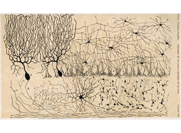
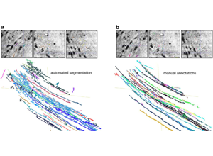

# 03 EM Prep and Imaging
Technical Training: Nanoscale Connectomics

---

## Session outcomes (60 minutes)
- Identify major artifact classes and their downstream failure modes.
- Define QA gates before large-scale reconstruction.
- Build a practical acquisition risk register with mitigation triggers.

---

## Pedagogical arc
- Hook: artifact examples and scientific consequences.
- Model: prep chain + QA checkpoints.
- Practice: classify artifacts and set gate thresholds.
- Check: triage decisions under constrained throughput.

---

## Acquisition chain (operational)
Fixation -> Staining -> Sectioning/block-face -> Imaging -> Stack assembly

Each stage introduces distinct, diagnosable error signatures.

---

## Visual context: prep/imaging stage map

- Instructor cue: ask where errors become irreversible.

---

## Visual context: artifact-bearing examples

- Use as a live taxonomy exercise (physical vs signal vs geometric).

---

## Artifact taxonomy with downstream impact
- Physical (tear/fold/chatter): topology discontinuities.
- Signal (charging/contrast drift): false boundaries, missed synapses.
- Geometric (misalignment/seams): apparent neurite breaks/merges.

---

## QA gates before full ingest
- Signal stability: SNR and intensity drift bounds.
- Geometric consistency: seam residual and alignment error limits.
- Completeness: missing/damaged section accounting.
- Metadata completeness: acquisition parameters and provenance.

---

## Pilot-first strategy
- Run pilot segmentation/QC on representative blocks.
- Quantify expected merge/split burden before full-volume processing.
- Adjust prep protocol if projected correction load is unacceptable.

---

## Throughput vs fidelity tradeoff
- Higher throughput without gates amplifies downstream correction cost.
- QA cost upfront is often cheaper than post hoc proofreading.
- Teach teams to model this explicitly, not intuitively.

---

## Misconceptions to correct
- "Artifacts can be cleaned up later without scientific cost."
- "Good visual quality implies quantitative adequacy."
- "Metadata can be reconstructed after acquisition."

---

## Activity: risk register workshop
For three artifact types, specify:
- detection metric,
- alert threshold,
- mitigation action,
- stop/go decision owner.

---

## Formative rubric
- Pass: each artifact has metric + threshold + mitigation.
- Strong: downstream impact quantified in scientific terms.
- Flag: qualitative descriptions without operational triggers.

---

## External paper figure slots
- Hayworth et al. EM imaging methodology figures (prep-to-imaging pipeline).
- Large-scale EM platform figure (multibeam / acquisition throughput tradeoff).
- QA dashboard example from open connectomics workflow publications.

---

## Bridge
Next unit: infrastructure for robust reconstruction once acquisition is trusted.
