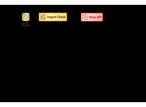
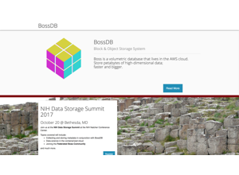

# 04 Volume Reconstruction Infrastructure
Technical Training: Nanoscale Connectomics

---

## Session outcomes (60 minutes)
- Design a reproducible ingest-to-serving architecture.
- Define lineage, release, and rollback requirements.
- Select reliability metrics (SLOs) aligned to scientific quality.

---

## Pedagogical arc
- Hook: how infrastructure failure becomes scientific failure.
- Model: architecture and data contracts.
- Practice: failure-mode tabletop exercise.
- Check: release-gate design defense.

---

## Reference architecture
Ingest -> Transform -> Inference -> Post-process -> Serving

Reliability and lineage are first-class scientific requirements.

---

## Visual context: pipeline overview

- Prompt: where would you place mandatory quality gates?

---

## Visual context: orchestration and stage dependencies

- Emphasize idempotence and region-scoped replay.

---

## Visual context: serving and analysis interface

- Make clear distinction: data plane vs control plane.

---

## Data contracts and lineage (minimum fields)
- input artifact IDs
- code/model version
- parameter hash
- timestamp + executor identity
- output artifact IDs

Without this, outputs are not auditable science.

---

## Orchestration essentials
- Idempotent jobs.
- Retry policy with bounded backoff.
- Region-scoped reprocessing.
- Deterministic build environment.

---

## Reliability SLOs tied to science
- Throughput (volume/day)
- Failure rate and MTTR
- Quality gate pass rate
- Cost envelope per released volume

---

## Failure modes and containment
- Non-deterministic rebuilds -> irreproducible claims.
- Provenance drift -> untraceable figures/tables.
- Hotspot bottlenecks -> stale releases and biased datasets.

---

## Tabletop exercise (10 min)
Given a failed post-process stage:
1. decide rollback scope,
2. identify required lineage fields,
3. define release hold criteria.

---

## Activity deliverable
One pipeline diagram including:
- gate locations,
- rollback triggers,
- mandatory lineage schema,
- on-call decision path.

---

## Rubric checkpoint
- Pass: rollback and lineage are explicit and feasible.
- Strong: failure detection links directly to release policy.
- Flag: architecture diagram without decision logic.

---

## External paper figure slots
- Januszewski et al. flood-filling network + infrastructure context figure.
- MICrONS pipeline/infrastructure overview figure.
- Cloud-scale segmentation/proofreading system architecture figure.

---

## Bridge
Next unit: ultrastructure interpretation on top of trusted reconstruction output.
