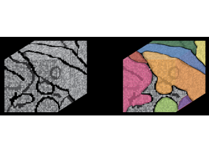
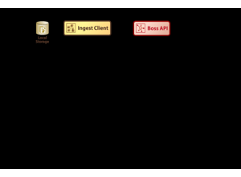
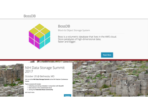

<!-- _class: title -->
<!-- _paginate: skip -->

Technical Course · Unit 04

# Volume Reconstruction Infrastructure

An editable graph over immutable atoms — and why every number you report needs a version.

---

## Session outcomes (60 minutes)
- Design a reproducible ingest-to-serving architecture.
- Define lineage, release, and rollback requirements.
- Select reliability metrics (SLOs) aligned to scientific quality.

---

## Pedagogical arc
- Hook: how infrastructure failure becomes scientific failure.
- Model: architecture and data contracts.
- Practice: failure-mode tabletop exercise.
- Check: release-gate design defense.

---

## Reference architecture
Ingest -> Transform -> Inference -> Post-process -> Serving

Reliability and lineage are first-class scientific requirements.

<!--
Expand the five boxes into the unit's eight stages, naming the artifact each produces — the artifact is what you debug. Ingest: an immutable, checksummed archive (the only irreplaceable asset). Stitching and alignment: a volume plus a versioned transform stack. Boundary/affinity prediction: a per-voxel map, computed over overlapping blocks. Supervoxels: deliberately over-segmented, immutable atoms. Agglomeration: a grouping of atoms, not a new labelling. Derived geometry: meshes, skeletons, per-object stats. Synapse detection: a table keyed to supervoxel IDs. Annotation and serving: Neuroglancer, proofreading, versioned tables.
-->

---

<!-- _class: figure -->

## Pipeline overview: from image to labels

Where would you place mandatory quality gates?

Source: assets_outreach source decks, Module14 L1 S04. Historical/context visual.

<!--
Instructor script: "On the left, image. On the right, labels. Everything between them is the pipeline. Where would you put a gate that stops the line?"
Expected answers: after alignment (residual distribution and maximum, per region — not a global mean); after affinity prediction (look for errors whose spatial distribution matches the block grid, the signature of too little overlap); before release (quality metrics from Unit 08, reviewed as a release candidate).
A 0.1-voxel-per-section alignment bias over 20,000 sections is a 2,000-voxel drift — that is why alignment gets a gate.
-->

---

<!-- _class: figure -->

## Service decomposition: ingest client and API

Emphasize idempotence and region-scoped replay.

Source: assets_outreach source decks, Module14 L1 S12. Historical/context visual.

<!--
Instructor script: "Separate services exist because the consumers want incompatible things." A proofreader scrolling z wants chunks elongated in z; an analysis job wants large sequential chunks; a synapse query wants small chunks and a good spatial index. Storing the data several times is the answer to "why is this here three times?", not redundancy.
Idempotence: re-running a stage on the same inputs and parameters gives the same output — GPU non-determinism, unpinned dependencies and unseeded randomness all break it. Region-scoped replay: a pipeline whose only recovery is "re-run everything" cannot fix a local defect at petascale.
-->

---

## Real data: raw EM vs automated segmentation

- Flood-filling network output: 197 distinct objects in this one field.
- Every colour is an object the pipeline asserts is continuous in 3D.

Source: H01 release (Lichtman Lab, Harvard; Connectomics at Google), CC BY 4.0 · Shapson-Coe et al. 2024, doi:10.1126/science.adk4858 · site render.

<!--
Instructor script: "Pick one colour and follow it. The pipeline is asserting that object is one continuous piece of one cell, across sections you cannot see on this slide."
Architecturally, each of those objects is a connected component of a graph whose nodes are immutable supervoxels. A merge is adding an edge — microseconds, not gigabytes. A split is removing edges via a minimum cut. Every edit is an append-only log entry with author and timestamp.
-->

---

<!-- _class: figure -->

## Serving: a public volumetric archive

BossDB, as presented in the source deck (2017-era). Make clear the distinction between data plane and control plane.

Source: assets_outreach source decks, Module14 L1 S19. Historical/context visual.

<!--
This is a historical slide: treat the page shown as context, not as current documentation. The data plane moves voxels and tables; the control plane decides versions, permissions and releases.
The analyst's consequence, and the most important sentence in the unit: object IDs are not stable. A root ID identifies an object as of a moment in time. An ID in a notebook, paper or caption is meaningless without a materialization version or timestamp — and the failure is silent: the code runs, it just answers a different question than last week.
-->

---

## Data contracts and lineage (minimum fields)
- input artifact IDs
- code/model version
- parameter hash
- timestamp + executor identity
- output artifact IDs

Without this, outputs are not auditable science.

<!--
Unit §4 adds: container image digest, random seeds, wall-clock and resource usage. And for analyses: the materialization version is a first-class part of the methods section, like a genome build.
Worked example from the unit: a figure reports 1,412 inputs; re-running today gives 1,530 for "the same cell". Pinning the query to candidate versions shows the figure used materialization 795; the edit log shows merges that reattached distal dendrite, carrying the 118 extra inputs. Both numbers are correct — for different objects. The original claim was under-specified, not wrong.
-->

---

## Orchestration essentials
- Idempotent jobs.
- Retry policy with bounded backoff.
- Region-scoped reprocessing.
- Deterministic build environment.

---

## Reliability SLOs tied to science
- Throughput (volume/day)
- Failure rate and MTTR
- Quality gate pass rate
- Cost envelope per released volume

<!--
Cost envelope, from unit §5 for 1 mm³: raw archive ~1.5 PB (cold); aligned pyramid ~2 PB (hot); affinities ~1.5 PB (delete after supervoxels, once you will not re-agglomerate); synapse table 50–200 GB, the hottest table. GPU inference: 1.5e15 voxels at 1e7 voxels/s/GPU is about 1,736 GPU-days — roughly 3.5 days on 500 GPUs, and you will run it 3–5 times.
Instructor script: "But the dominant cost is none of these. It is proofreading labor." Also name the traps: egress, unsharded small objects, forgotten intermediates, idle hot storage.
-->

---

## Failure modes and containment
- Non-deterministic rebuilds -> irreproducible claims.
- Provenance drift -> untraceable figures/tables.
- Hotspot bottlenecks -> stale releases and biased datasets.

---

## Tabletop exercise (10 min)
Given a failed post-process stage:
1. decide rollback scope,
2. identify required lineage fields,
3. define release hold criteria.

<!--
A good follow-up from the unit's check-yourself: a collaborator sends 200 neuron IDs from six months ago. Do not query them against the current segmentation. Ask which version they came from; map them forward through the lineage service; report the churn (how many mapped 1:1, split, merged); and if exact reproduction is required, query the old version directly.
-->

---

## Activity deliverable
One pipeline diagram including:
- gate locations,
- rollback triggers,
- mandatory lineage schema,
- on-call decision path.

---

## Rubric checkpoint
- Pass: rollback and lineage are explicit and feasible.
- Strong: failure detection links directly to release policy.
- Flag: architecture diagram without decision logic.

---

## Pair with this unit
- Januszewski et al. (2018), *Nature Methods*, doi:10.1038/s41592-018-0049-4 — flood-filling networks.
- MICrONS Consortium (2025), *Nature*, doi:10.1038/s41586-025-08790-w — CAVE-served, versioned release.
- Dorkenwald et al. (2024), *Nature*, doi:10.1038/s41586-024-07558-y — community proofreading on a versioned graph.

---

## Bridge
Next unit: ultrastructure interpretation on top of trusted reconstruction output.
