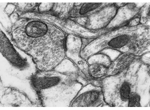

# 05 Neuronal Ultrastructure
Technical Training: Nanoscale Connectomics

---

## Learning goals
- Identify core neuronal ultrastructural features in EM.
- Apply a context-aware labeling protocol.
- Record uncertainty in reproducible decision logs.

---

## Compartment orientation

- Start with compartment candidates before assigning function.

---

## Dendritic context

- Evaluate branch geometry and local neighborhood.

---

## Synapse-identification cues

- Require convergent cues (vesicles, active zone, PSD context).

---

## Organelle context

- Use organelles to disambiguate difficult profiles.

---

## Comparative case

- Similar appearances can imply different labels with context.

---

## Ambiguity protocol

- Mark uncertain calls explicitly; do not force binary labels.

---

## Advanced example

- Adjudication should compare at least two plausible interpretations.

---

## Synthesis panel

- Apply full cue triangulation checklist.

---

## QC metrics
- Inter-annotator agreement on compartment labels.
- Uncertainty rate by region.
- Synapse call precision/recall on gold subset.

---

## In-class activity
Annotate one panel with:
- 3 cues supporting your label.
- Confidence tier.
- 1 alternate hypothesis.

---

## Attribution
Figures derived from Pat Rivlin MICrONS proofreading training materials (111821).
