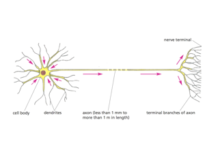
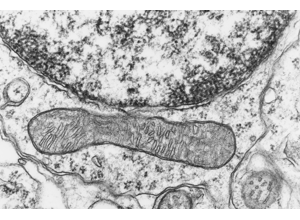
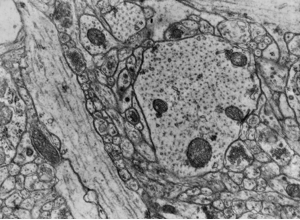
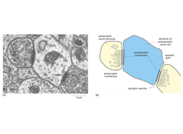
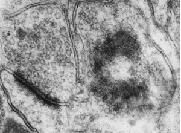

# 05 Neuronal Ultrastructure
Technical Training: Nanoscale Connectomics

---

## Session outcomes (60 minutes)
- Make compartment and synapse calls using multi-cue evidence chains.
- Assign confidence tiers (`high`, `medium`, `uncertain`) with explicit rationale.
- Separate unresolved ambiguity from incorrect labeling.

---

## Pedagogical arc
- Model: expert think-aloud for one patch.
- Guided practice: easier then ambiguous cases.
- Consensus: resolve disagreements with rubric rules.
- Check: one fully justified call per learner.

---

## Evidence language for this unit
- A label is a claim.
- A cue is evidence.
- Confidence is uncertainty metadata.
- Disagreement is signal about policy gaps.

---

## Visual grounding: compartment orientation

- Instructor move: ask learners for two independent cues before naming compartment.

---

## Visual grounding: dendritic context

- Emphasize neighborhood context, not isolated texture patterns.

---

## Synapse cue set

- Require membrane apposition + vesicle field + postsynaptic context.

---

## Organelle-assisted disambiguation

- Use organelles to support or reject first-pass labels.

---

## Comparative ambiguity case

- Teach explicit alternate hypothesis statement.

---

## Advanced adjudication case

- Decision policy: escalate when cue conflict persists across slices.

---

## Decision protocol (operational)
1. Propose candidate label.
2. Cite at least two independent cues.
3. Check adjacent-slice continuity.
4. Assign confidence tier and uncertainty note.
5. Escalate if evidence conflict remains.

---

## Frequent failure modes
- Single-cue overconfidence.
- Contrast-only synapse calls.
- Ignoring z-context.
- Treating uncertainty as failure.

---

## Teaching move: misconception correction loop
- Present one intentionally ambiguous patch.
- Collect independent labels.
- Debrief by evidence chain, not by authority.
- Update shared rubric wording.

---

## Activity (12 min)
For two ambiguous patches, submit:
- label,
- two supporting cues,
- confidence tier,
- one alternative hypothesis considered.

---

## Rubric checkpoint
- Pass: multi-cue evidence + confidence tag present.
- Strong: rationale includes cross-slice verification.
- Flag: definitive label with weak or single evidence source.

---

## External paper figure integration
- Kasthuri et al. 2015 (Cell): dense cortical ultrastructure examples.
- Harris & Weinberg 2012 (Cold Spring Harb Perspect Biol): synapse ultrastructure schema.
- MICrONS publications: dataset-specific morphology exemplars.

---

## References and attribution
- Internal visuals: Pat Rivlin proofreading training set.
- Journal-club tie-ins:
  - https://doi.org/10.1016/j.cell.2015.06.054
  - https://doi.org/10.1101/cshperspect.a005587
