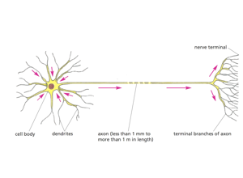
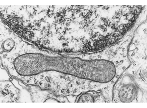
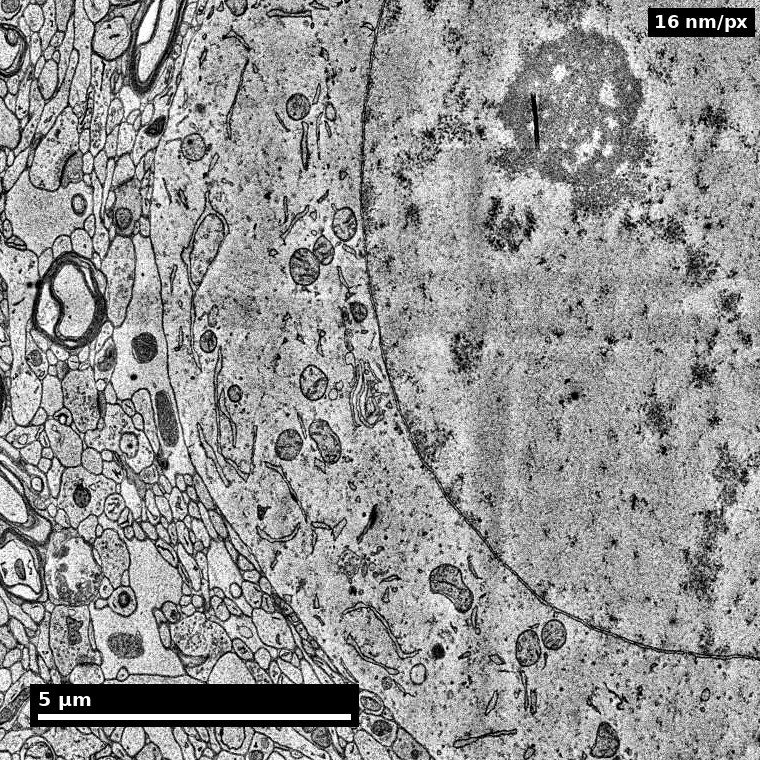
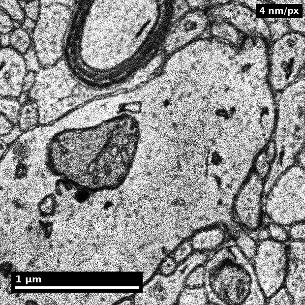
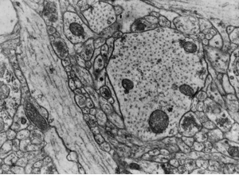
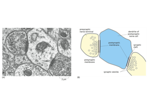
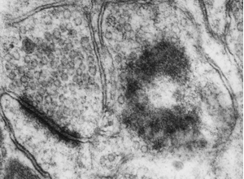
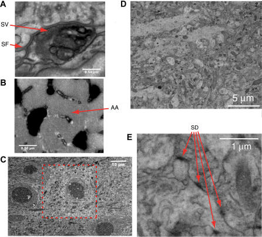

<!-- _class: title nanoscale -->

Human cortex · H01 Object segmentation over electron microscopy

H01 release · Lichtman Lab / Harvard &amp; Connectomics at Google · CC BY 4.0 Shapson-Coe et al. (2024) · doi:10.1126/science.adk4858

<!-- _paginate: skip -->

Technical Course · Unit 05

# Neuronal Ultrastructure

The actual visual cues, with sizes: which organelles, how big, and what they rule out.

---

## Session outcomes (60 minutes)
- Make compartment and synapse calls using multi-cue evidence chains.
- Assign confidence tiers (`high`, `medium`, `uncertain`) with explicit rationale.
- Separate unresolved ambiguity from incorrect labeling.

---

## Pedagogical arc
- Model: expert think-aloud for one patch.
- Guided practice: easier then ambiguous cases.
- Consensus: resolve disagreements with rubric rules.
- Check: one fully justified call per learner.

---

## Evidence language for this unit
- A label is a claim.
- A cue is evidence.
- Confidence is uncertainty metadata.
- Disagreement is signal about policy gaps.

<!--
Instructor script: "Two facts alone resolve a large share of early-annotator confusion: ribosomes rule out axon, and glycogen granules indicate astrocyte." Put the organelle table from unit §1 on screen or in hand for the rest of the session — sizes are approximate, but relative sizes and presence/absence patterns are what you actually use.
-->

---

<!-- _class: figure -->

## Compartment orientation

Fix the vocabulary before meeting anything ambiguous: cell body, dendrites, axon, terminal branches.

Source: Pat Rivlin training materials (MICrONS proofreading deck), RIV-ULTRA S04.

<!--
Instructor move: for each compartment on the diagram, ask the room which organelles they would expect present and — more usefully — which would be absent. Then require two independent cues before anyone names a compartment in the EM that follows.
-->

---

<!-- _class: figure -->

## Soma anchor: nucleus and mitochondrion

Nuclear envelope with heterochromatin above, one long mitochondrion below.

Source: Pat Rivlin training materials (MICrONS proofreading deck), RIV-ULTRA S08.

<!--
This anchors the soma end of the compartment table: rough ER and a nucleus put you in a cell body, the one place where the ribosome cue is unambiguous rather than a judgment call. Point out the mitochondrion's double membrane and cristae — mitochondria are everywhere except thin spine necks, so they are consistent with every compartment and discriminate none.
-->

---

## Real data: a human cortical soma

- Large pale nucleus, single prominent nucleolus, RER-rich cytoplasm.
- The nucleus/nucleolus cue is what makes somata findable at low magnification.

Source: H01 release (Lichtman Lab, Harvard; Connectomics at Google), CC BY 4.0 · Shapson-Coe et al. 2024, doi:10.1126/science.adk4858 · site render.

<!--
Instructor script: "Same cue, real human tissue, rendered from the public H01 volume. Find the nucleolus first, then trace the nuclear envelope, then look outward into the neuropil." The contrast between the pale soma and the dense neuropil around it is what lets you find cell bodies before you can resolve any synapse.
-->

---

## Real data: dendrite and its organelles

- Labeled 'dendrite' by H01's own subcompartment model.
- Large branched mitochondria: an organelle cue that argues against axonal identity.

Source: H01 release (Lichtman Lab, Harvard; Connectomics at Google), CC BY 4.0 · Shapson-Coe et al. 2024, doi:10.1126/science.adk4858 · site render.

<!--
The label here comes from a model, not an expert — treat it as a claim with evidence, like any other label. Ask the room for a second, independent cue before accepting it: microtubules in loose parallel arrays, ribosome rosettes, or a spine emerging. Remember the rule from unit §4: three microtubule observations are one piece of evidence; a ribosome plus a spine plus a taper is three.
-->

---

<!-- _class: figure -->

## Synapse cue set

Require membrane apposition + vesicle field + postsynaptic context.

Source: Pat Rivlin training materials (MICrONS proofreading deck), RIV-ULTRA S09.

<!--
The three criteria, all required: a presynaptic vesicle cluster at the apposition itself; a cleft of uniform width (20–30 nm asymmetric, ~15–20 nm symmetric); a postsynaptic density. Plus persistence: a real synapse 200–500 nm wide should appear on two to five 40 nm sections.
Instructor script: "The single most common beginner error is calling a synapse from dark contrast alone. A tangentially cut membrane, precipitate, a glial apposition or an adherens junction can all look dark. No vesicles, no synapse."
-->

---

<!-- _class: figure -->

## Vesicles and organelles at annotation scale

Use organelles to support or reject first-pass labels — and measure before naming.

Source: Pat Rivlin training materials (MICrONS proofreading deck), RIV-ULTRA S10.

<!--
Check size against the table before naming anything: clear synaptic vesicles run 35–50 nm, dense-core vesicles 80–120 nm, microtubules ~25 nm across. This is a measurement rather than an impression. Vesicle shape is partly a fixation artifact, and it is not independent of vesicle visibility — if you cannot see vesicles clearly, you cannot use their shape either.
-->

---

<!-- _class: figure -->

## From schematic to micrograph

Read the labeled schematic first, then find each part in the micrograph beside it.

Source: Pat Rivlin training materials (MICrONS proofreading deck), RIV-ULTRA S20.

<!--
The schematic names the presynaptic terminal, presynaptic and postsynaptic membranes, cleft, vesicles and the postsynaptic dendrite. The translation from idealized diagram to real, noisy tissue is the step the three synapse criteria have to survive. Teach an explicit alternative-hypothesis statement for any structure a learner cannot locate in the micrograph.
-->

---

<!-- _class: figure -->

## Advanced adjudication case

Decision policy: escalate when cue conflict persists across slices.

Source: Pat Rivlin training materials (MICrONS proofreading deck), RIV-ULTRA S24.

<!--
Build a full evidence chain in the form of the unit's worked example — geometry, organelle content, synaptic role, neighborhood — and stop at the point where the chain would need continuity across sections that a single still cannot supply. Stopping there, and saying so, is the correct output.
-->

---

## Decision protocol (operational)
1. Propose candidate label.
2. Cite at least two independent cues.
3. Check adjacent-slice continuity.
4. Assign confidence tier and uncertainty note.
5. Escalate if evidence conflict remains.

<!--
Define the tiers operationally (unit §3). High: two or more independent cues agree and continuity across three or more sections confirms. Medium: one strong cue, or two non-independent cues. Uncertain: cues conflict, or the decisive cue is not visible.
"Uncertain" is a valid and valuable output. A dataset with 8% of calls flagged uncertain with reasons is more useful than one with 100% forced — the uncertain set is exactly the review queue.
Independent cue families: geometry and caliber; organelle content; synaptic role; neighborhood; long-range continuity. Two cues from different families is the checkable rule for high confidence.
-->

---

## Frequent failure modes
- Single-cue overconfidence.
- Contrast-only synapse calls.
- Ignoring z-context.
- Treating uncertainty as failure.

---

## Teaching move: misconception correction loop
- Present one intentionally ambiguous patch.
- Collect independent labels.
- Debrief by evidence chain, not by authority.
- Update shared rubric wording.

<!--
A good patch from the unit's check-yourself: a bouton with round clear vesicles making a thick-PSD contact onto a spine head, and apparently also a thin symmetric contact onto a nearby shaft. Most likely the second contact is not a synapse from this bouton — check for vesicles at that apposition. If it genuinely is, one terminal making both types would be unusual: suspect a merge error that fused two axons. The biology looks wrong, so suspect the segmentation.
-->

---

## Activity (12 min)
For two ambiguous patches, submit:
- label,
- two supporting cues,
- confidence tier,
- one alternative hypothesis considered.

---

## Rubric checkpoint
- Pass: multi-cue evidence + confidence tag present.
- Strong: rationale includes cross-slice verification.
- Flag: definitive label with weak or single evidence source.

---

<!-- _class: figure -->

## Serial block-face EM: where the method came from

Block-face images from Figure 1 of the paper that introduced serial block-face scanning EM.

Source: Denk &amp; Horstmann (2004), <em>PLOS Biology</em>, doi:10.1371/journal.pbio.0020329, Fig. 1. CC BY.

<!--
Use this to connect the cue work back to acquisition: block-face imaging gives near-perfect z-alignment and no lost sections, which is exactly what makes cross-slice continuity — step 3 of the protocol — practical. The trade-off is z-resolution that limits thin-process tracing (Unit 02's modality chart).
-->

---

## References and attribution
- Figures RIV-ULTRA: Pat Rivlin training materials (MICrONS proofreading deck).
- Real-data figures: H01 release, Shapson-Coe et al. (2024), doi:10.1126/science.adk4858.
- Kasthuri et al. (2015), *Cell*, doi:10.1016/j.cell.2015.06.054 — dense cortical ultrastructure.
- Harris & Weinberg (2012), *Cold Spring Harb Perspect Biol*, doi:10.1101/cshperspect.a005587 — synapse ultrastructure.
