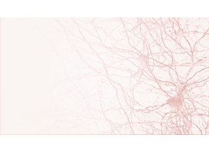
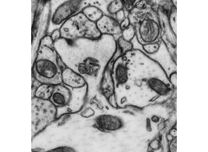
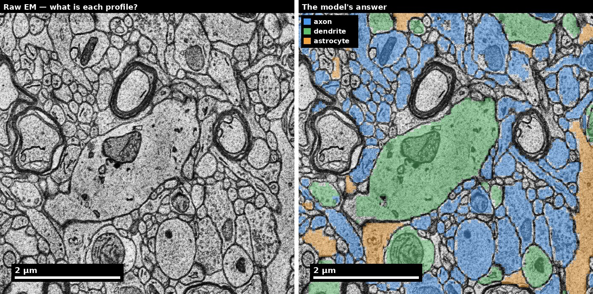
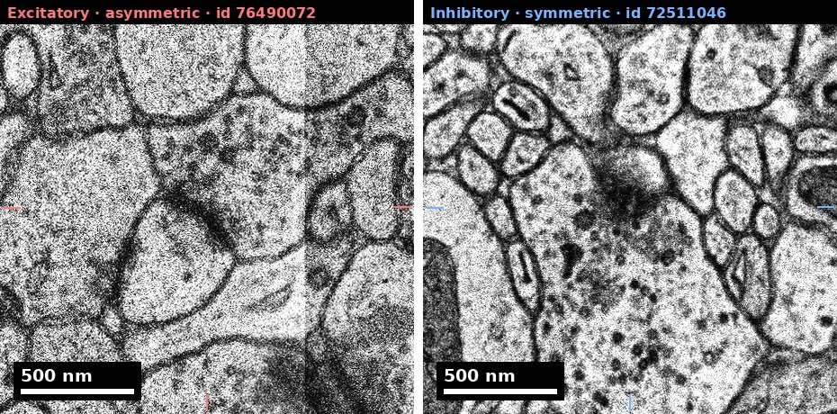
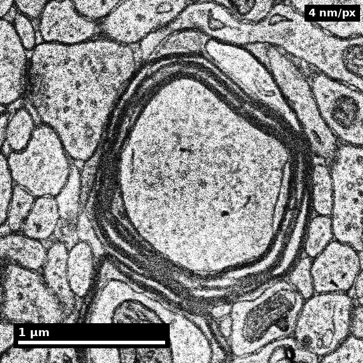
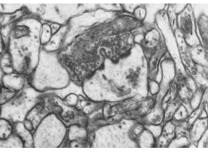
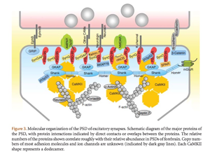
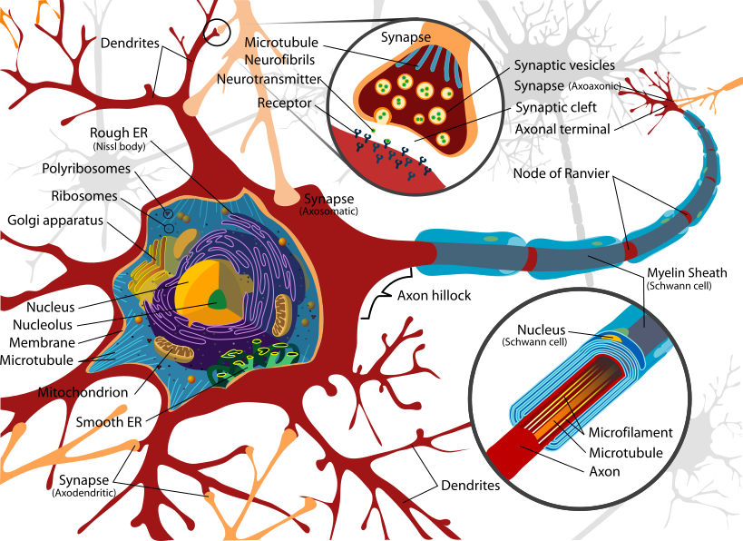

<!-- _class: title -->
# 06 Axons and Dendrites
Technical Training: Nanoscale Connectomics

---

## Session outcomes (60 minutes)
- Classify neurites using a reproducible multi-cue protocol.
- Document uncertainty and escalation rationale for edge cases.
- Quantify classification quality with confusion-style summaries.

---

## Pedagogical arc
- Model: expert classifies one neurite live.
- Practice: pair annotation on mixed-evidence panels.
- Consensus: adjudication and policy revision.
- Check: justified final call and uncertainty note.

---

## Why this unit is high leverage
- Axon/dendrite identity errors distort connectivity statistics.
- Misclassification propagates into motif analysis and model priors.
- Reproducible identity policy is a prerequisite for trustworthy graphs.

---

<!-- _class: figure -->
## Visual context: morphology baseline

---

<!-- _class: figure -->
## Visual context: dendritic cue panel

---

## Classify these profiles, then check

- Left: raw human cortex. Right: the model's answer key.
- Blue axon, green dendrite, orange astrocyte — note how many are genuinely hard.

---

## Real data: excitatory vs inhibitory synapse

- Matched scale, nothing drawn over either density.
- At 4 nm a Type I PSD is 8–12 px — the asymmetry is subtle, and the classifier is 85–87% accurate.

---

## Real data: a myelinated axon

- Compact myelin reads as a dark annulus at 4 nm.
- Individual lamellae (12 nm period = 3 px) are NOT resolvable here.

---

<!-- _class: figure -->
## Visual context: axonal cue panel

---

<!-- _class: figure -->
## Side-by-side discrimination

- Ask learners to justify which cue would survive lower image quality.

---

<!-- _class: figure -->
## Ambiguous process case

- Train weighted-evidence reasoning, not binary heuristics.

---

<!-- _class: figure -->
## Continuity check case

- Require short-path continuity inspection before final call.

---

## High-complexity edge case
- Escalate unresolved ambiguity to adjudication queue.

---

## Operational classification protocol
1. Initial morphology read.
2. Synaptic/organellar context check.
3. Continuity check in adjacent slices.
4. Confidence assignment.
5. Escalation if evidence conflict persists.

---

## Misconceptions to correct
- "Thin process = axon".
- "One bouton-like feature determines identity".
- "Ambiguous means annotator failed".

---

## Activity
Classify three ambiguous neurites and submit:
- primary label,
- cue table,
- confidence,
- alternate label and why rejected.

---

## Rubric checkpoint
- Pass: label plus two independent cues.
- Strong: includes continuity evidence and uncertainty logic.
- Flag: unsupported hard labels.

---

## External paper figure integration
- Kasthuri et al. 2015: process morphology examples in dense reconstructions.
- MICrONS/FlyWire morphology figures for large-scale context.
- Optional neuroanatomy atlas figure for compartment-level validation.

---

## External inserted figure (open license)

- Source URL: https://commons.wikimedia.org/wiki/Special:FilePath/Complete_neuron_cell_diagram_en.svg
- License: Public domain (Wikimedia Commons file metadata).

---

## References and attribution
- Internal visuals: Pat Rivlin axon/dendrite training set.
- Journal-club tie-in: https://doi.org/10.1016/j.cell.2015.06.054
