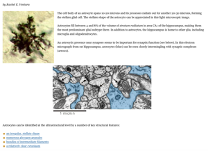
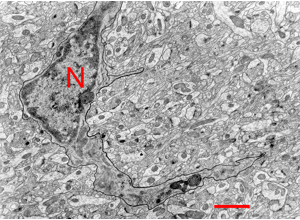

# 07 Glia
Technical Training: Nanoscale Connectomics

---

## Learning goals
- Distinguish astrocyte, microglia, and oligodendrocyte cues.
- Reduce glia-neuron boundary errors in proofreading.

---

## Why glia matter operationally
Glia labels directly affect segmentation quality and downstream interpretation.

---

## Unit opener context

- Frame glia as central structural context, not background.

---

## Astrocyte context cues

- Combine morphology with neighborhood evidence.

---

## Microglia context cues

- Require multi-slice confirmation in ambiguous regions.

---

## Oligodendrocyte cue context

- Track myelin-related structural relationships.

---

## Myelin-producing glia context

- Use local architecture to disambiguate class identity.

---

## Ambiguity and escalation
- Tag uncertainty type before adjudication.
- Use second-pass review queue for low-confidence calls.

---

## QC metrics
- Glia-vs-neuron boundary error rate.
- Class-level agreement by region.
- Unresolved-case rate after secondary review.

---

## Failure modes
- Over-calling microglia from partial morphology.
- Under-prioritizing glia corrections in proofreading triage.

---

## Activity
Classify 2 ambiguous regions with:
- class label,
- key cues,
- uncertainty note.

---

## Attribution
Figures derived from Pat Rivlin MICrONS proofreading training materials (111821).
