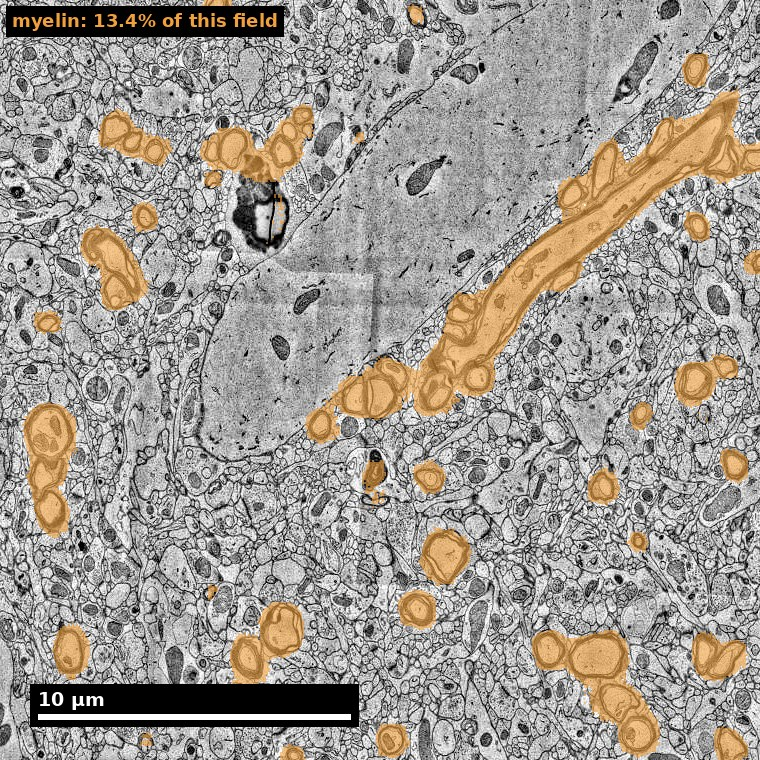

<!-- _class: title -->
<!-- _paginate: skip -->

Technical Course · Unit 07

# Glia

Astrocytes, oligodendrocytes and microglia in EM — and why a single glia–neuron merge is one of the most expensive errors in the volume.

---

## Session outcomes (60 minutes)
- Distinguish major glial classes in EM-oriented workflows.
- Reduce glia-neuron boundary errors in proofreading.
- Prioritize glia-related corrections by downstream impact.

---

## Pedagogical arc
- Concept refresh: glia as active circuit context.
- Visual discrimination: class-specific cues.
- Practice: ambiguity triage and escalation.
- Check: class call plus uncertainty and action plan.

---

## Why this matters technically
- Glia errors can induce merge/split cascades.
- Boundary mistakes alter neuron-centric metrics.
- Myelin and glial context changes interpretation of nearby neurites.

<!--
Walk one merge (unit §1): a fine astrocytic process fused onto a dendrite. The neuron gains a branch that does not exist. Because astrocytic processes ensheathe synapses, the merged path runs directly past many of them, and those detections get attributed to the neuron — inputs from cells it never contacted. The false inputs are spatially local, so they inflate local clustering and short-range connectivity.
Instructor script: "Again the bias points toward an interesting result. That is why glia–neuron merges rank above many neuron–neuron splits in the queue, even though the split is more visually obvious."
-->

---

<!-- _class: figure -->

## Orientation: the stake

Glia occupy roughly 20–40% of cortical volume.

Source: Pat Rivlin training materials (MICrONS proofreading deck), RIV-GLIA S01.

<!--
Set the stake before anyone starts looking: a glia–neuron merge does not merely add a branch — it drags a neuron's arbor past synapses it never contacted, so the false-input yield per micrometre of merged path is unusually high.
Each glial class has one near-diagnostic feature. Learn those three first: astrocyte — glycogen granules; oligodendrocyte — the darkest nucleus in the field; microglia — a dense elongated nucleus plus lysosomal content.
-->

---

<!-- _class: figure -->

## Astrocyte morphology in a synaptic neighbourhood

An astrocytic process is space-filling; a neurite is a tube.

Source: Ventura RE, "Astrocytes," SynapseWeb (Kristen M. Harris Lab, UT Austin), synapseweb.clm.utexas.edu/astrocytes. &copy; The University of Texas at Austin; no reuse licence is stated &mdash; confirm permission before this deck is shared outside the course.

<!--
Read cross-sectional shape before anything else. An astrocytic process takes whatever contour is left over after the neurites pack; a neurite holds a tube shape of its own. That cue survives weak staining better than glycogen granules do, which makes it the one to reach for where everything else fails.
Other astrocyte cues from unit §2: pale "watery" cytoplasm with few organelles; glycogen granules 20–30 nm, very dark, clustered (neurons do not contain them); perisynaptic processes under 100 nm thick; endfeet flattened against vessels; no vesicles, no PSDs, few microtubules.
-->

---

## Real data: an astrocytic process

- Pale cytoplasm, irregular space-filling outline that wraps its neighbours.
- Labelled 'astrocyte' by H01's subcompartment model.

Source: H01 release (Lichtman Lab, Harvard; Connectomics at Google), CC BY 4.0 · Shapson-Coe et al. 2024, doi:10.1126/science.adk4858 · site render.

<!--
Instructor script: "Trace the outline with your finger. Does it hold its own shape, or does it fill the gaps the neurites left?"
Use the unit's check-yourself: a pale, irregular profile between three neurites, no glycogen visible. Probably astrocytic — medium confidence at best. Absence of glycogen is weak evidence because granules are clustered and sparse. Better evidence, in order: space-filling behaviour over several sections; no vesicles or PSD on it; continuity to an endfoot; microtubules at higher magnification.
-->

---

## Real data: cortical vasculature

- H01 contains ~230 mm of blood vessels across ~1 mm³.
- Vessels are a common site of merge errors — glia wrap them closely.

Source: H01 release (Lichtman Lab, Harvard; Connectomics at Google), CC BY 4.0 · Shapson-Coe et al. 2024, doi:10.1126/science.adk4858 · site render.

<!--
Walk the unit's worked example here: a pale profile a few hundred nanometres thick, pressed flat against a capillary, currently assigned to a nearby dendrite. Rule out synaptic participation first — even when the vascular context is shouting the answer. Glycogen absent: weak evidence, noted not spent. Over 5–10 sections the contour spreads to track the vessel wall: space-filling. Context: a flattened expansion covering a vessel is an endfoot. Dismiss microglia for cause — the parent process is pale and organelle-poor, not inclusion-rich.
Call: astrocytic endfoot, high confidence; the dendrite assignment is a glia–neuron merge and goes above conspicuous splits in the queue.
-->

---

<!-- _class: figure -->

## Microglia cues

Weight nuclear evidence above process shape.

Source: Pat Rivlin training materials (MICrONS proofreading deck), RIV-GLIA S09.

<!--
Look for the pairing that carries the call: a dark, often elongated or bean-shaped nucleus with heterochromatin clumped against the envelope, plus lysosomal and phagosomal content in dense cytoplasm with long, narrow ER cisternae. Microglia are the least stereotyped of the three classes because morphology tracks activation state — which is why nuclear evidence outranks process shape, and why a microglia call needs a nucleus or a lysosome-rich parent process, never a fragment.
-->

---

## Oligodendrocyte-associated cue context

- **Diagnostic feature:** the darkest nucleus in the field &mdash; small, round, extremely
  electron-dense heterochromatin, identifiable at low magnification.
- Dense cytoplasm: abundant rough ER and ribosomes, prominent Golgi. Soma ~6&ndash;8 &micro;m.
- Processes connect the soma to myelin sheaths; one cell myelinates on the order of
  20&ndash;60 axonal segments.
- **The hard case is not the mature cell.** It is the OPC (NG2 cell): paler nucleus, can
  resemble a small neuron or an astrocyte. "Sort of oligodendrocyte but the nucleus is not
  dark enough" means OPC is the leading hypothesis &mdash; flag it, do not force the call.

*No extracted micrograph exists for this class; the full cue table is in Unit 07 §2.*

<!--
Instructor script: "If you remember one thing about oligodendrocytes, it is the nucleus: distinctly darker than neuronal or astrocytic nuclei, usually identifiable at a glance." Then spend the time on the OPC: the correct action for a "not quite" cell is to flag rather than force. A flagged OPC candidate is a useful annotation; a forced wrong class is not.
-->

---

## Myelin-context interpretation

- Myelin is the fastest route to an oligodendrocyte identification: follow a sheath back to the soma that owns it.
- A merge across a myelinated axon costs more than one across an unmyelinated process: the axon it corrupts is long-range.

Source: H01 release (Lichtman Lab, Harvard; Connectomics at Google), CC BY 4.0 · Shapson-Coe et al. 2024, doi:10.1126/science.adk4858 · site render.

<!--
The panel highlights every myelinated axon the H01 myelin mask finds in one grey-matter field — a small minority of profiles in cortex. Instructor cue: ask how myelin context changes proofreading priority. Context cues from the protocol: the inner or outer tongue of a myelin sheath, or a paranodal loop, is a high-confidence oligodendrocyte call.
-->

---

## Operational glia triage protocol
1. Identify likely class from morphology/context.
2. Validate local boundary integrity.
3. Estimate downstream risk if left uncorrected.
4. Route to immediate correction or adjudication queue.

<!--
The unit's identification protocol, which feeds step 1: (1) soma? read the nucleus first — very dark and round -> oligodendrocyte; dark, elongated, peripheral heterochromatin plus lysosomes -> microglia; pale, irregular, glycogen -> astrocyte; pale but "not quite" -> OPC candidate, flag. (2) Synaptic participation -> neurite, go to Unit 06. (3) Glycogen -> astrocyte. (4) Cross-sectional character over 5–10 sections. (5) Context: endfoot, myelin tongue, lysosome-rich parent. (6) Unresolved -> uncertain, with the missing cue named.
Context is the strongest cue in the protocol, but it is only safe after the exclusion steps have run.
-->

---

## Metrics to track
- Glia-neuron boundary error rate.
- Class-specific agreement across reviewers.
- Escalation rate and resolution time.
- Downstream correction impact on network summaries.

---

## Misconceptions to correct
- "Glia are background, neuron labels matter more."
- "Any dark process near myelin is neuronal."
- "Class call can be deferred indefinitely without impact."

---

## Activity
Classify two ambiguous glia-neuron interfaces and submit:
- class hypothesis,
- boundary-confidence score,
- correction priority rank,
- escalation note if unresolved.

---

## Rubric checkpoint
- Pass: class + boundary rationale + action path.
- Strong: explicit risk prioritization and uncertainty language.
- Flag: class label without boundary logic.

---

<!-- _class: figure -->

## The three classes, schematically

Source: Holly Fischer, Wikimedia Commons, File:Glial_Cell_Types.png. CC BY 3.0 Unported.

---

## References and attribution
- Figures RIV-GLIA: Pat Rivlin training materials (MICrONS proofreading deck).
- Real-data figures: H01 release, Shapson-Coe et al. (2024), doi:10.1126/science.adk4858.
- Harris & Weinberg (2012), *Cold Spring Harb Perspect Biol*, doi:10.1101/cshperspect.a005587 — synaptic neighbourhood context.
