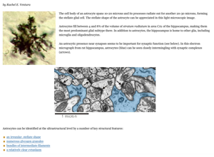
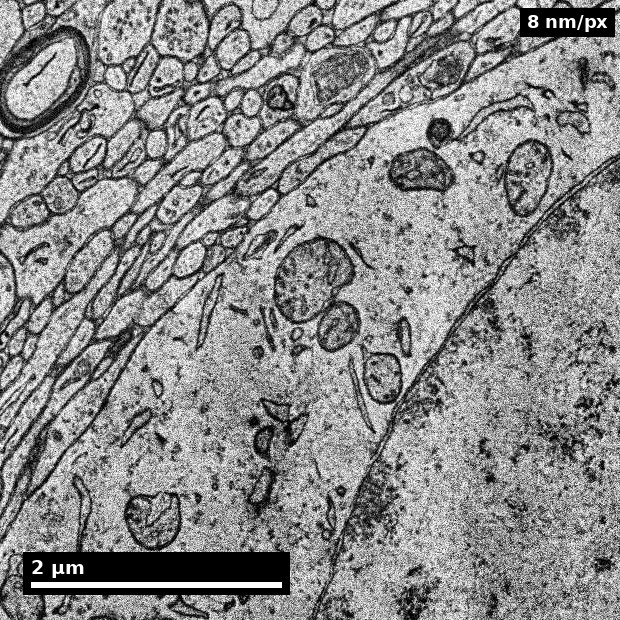
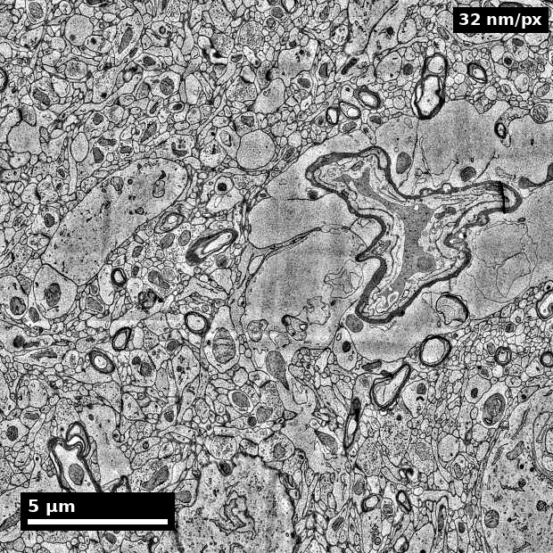
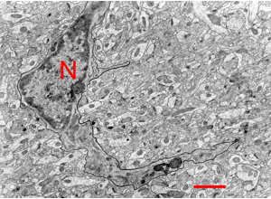
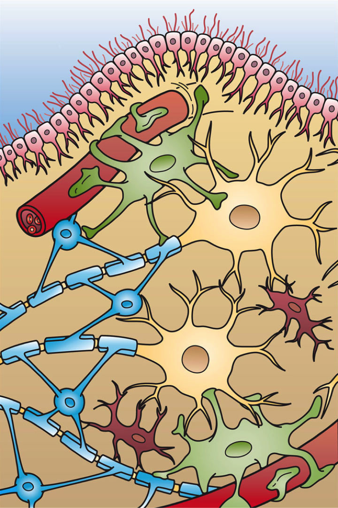

<!-- _class: title -->
# 07 Glia
Technical Training: Nanoscale Connectomics

---

## Session outcomes (60 minutes)
- Distinguish major glial classes in EM-oriented workflows.
- Reduce glia-neuron boundary errors in proofreading.
- Prioritize glia-related corrections by downstream impact.

---

## Pedagogical arc
- Concept refresh: glia as active circuit context.
- Visual discrimination: class-specific cues.
- Practice: ambiguity triage and escalation.
- Check: class call plus uncertainty and action plan.

---

## Why this matters technically
- Glia errors can induce merge/split cascades.
- Boundary mistakes alter neuron-centric metrics.
- Myelin and glial context changes interpretation of nearby neurites.

---

<!-- _class: figure -->
## Visual context: orientation

---

<!-- _class: figure -->
## Astrocyte-associated cue context

---

## Real data: an astrocytic process

- Pale cytoplasm, irregular space-filling outline that wraps its neighbours.
- Labelled 'astrocyte' by H01's subcompartment model.

---

## Real data: cortical vasculature

- H01 contains ~230 mm of blood vessels across ~1 mm³.
- Vessels are a common site of merge errors — glia wrap them closely.

---

<!-- _class: figure -->
## Microglia-associated cue context

---

## Oligodendrocyte-associated cue context

- **Diagnostic feature:** the darkest nucleus in the field &mdash; small, round, extremely
  electron-dense heterochromatin, identifiable at low magnification.
- Dense cytoplasm: abundant rough ER and ribosomes, prominent Golgi. Soma ~6&ndash;8 &micro;m.
- Processes connect the soma to myelin sheaths; one cell myelinates on the order of
  20&ndash;60 axonal segments.
- **The hard case is not the mature cell.** It is the OPC (NG2 cell): paler nucleus, can
  resemble a small neuron or an astrocyte. "Sort of oligodendrocyte but the nucleus is not
  dark enough" means OPC is the leading hypothesis &mdash; flag it, do not force the call.

*No extracted micrograph exists for this class; see Unit 07 §2 for the reference images.*

---

## Myelin-context interpretation

- Myelin is the fastest route to an oligodendrocyte identification: follow a sheath back to
  the soma that owns it.
- Instructor cue: ask how myelin context changes proofreading priority. A merge across a
  myelinated axon costs more than one across an unmyelinated process, because the axon it
  corrupts is long-range.

---

## Operational glia triage protocol
1. Identify likely class from morphology/context.
2. Validate local boundary integrity.
3. Estimate downstream risk if left uncorrected.
4. Route to immediate correction or adjudication queue.

---

## Metrics to track
- Glia-neuron boundary error rate.
- Class-specific agreement across reviewers.
- Escalation rate and resolution time.
- Downstream correction impact on network summaries.

---

## Misconceptions to correct
- "Glia are background, neuron labels matter more." 
- "Any dark process near myelin is neuronal." 
- "Class call can be deferred indefinitely without impact."

---

## Activity
Classify two ambiguous glia-neuron interfaces and submit:
- class hypothesis,
- boundary-confidence score,
- correction priority rank,
- escalation note if unresolved.

---

## Rubric checkpoint
- Pass: class + boundary rationale + action path.
- Strong: explicit risk prioritization and uncertainty language.
- Flag: class label without boundary logic.

---

## External paper figure integration
- Connectomics papers with glia-aware reconstruction examples.
- Myelination and ultrastructure review figures for context.
- Dataset-specific glia annotation benchmark figures when available.

---

## External inserted figure (open license)

- Source URL: https://commons.wikimedia.org/wiki/Special:FilePath/Glial_Cell_Types.png
- License: CC BY 3.0 Unported.

---

## References and attribution
- Internal visuals: Pat Rivlin glia training set.
- Suggested supporting review: Harris & Weinberg (2012) for synaptic neighborhood context.
