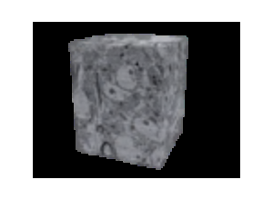
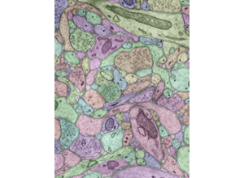
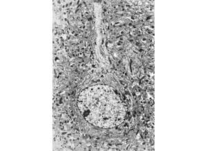
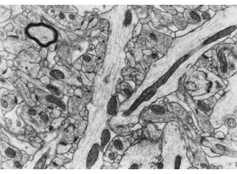
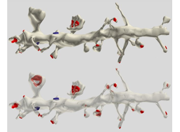
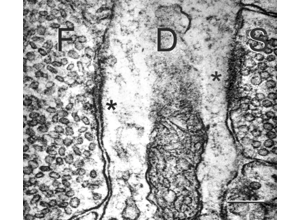
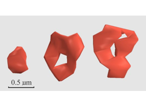
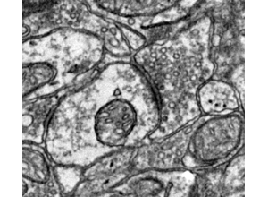
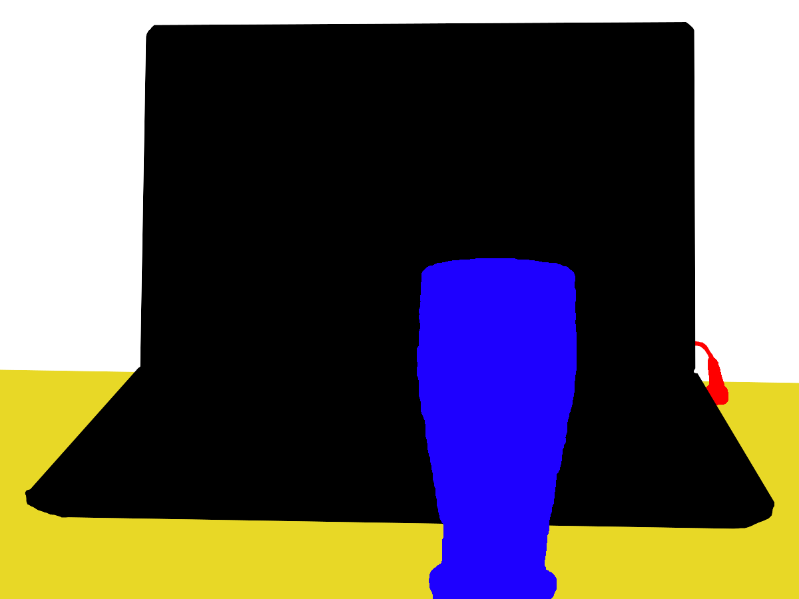

# 08 Segmentation and Proofreading
Technical Training: Nanoscale Connectomics

---

## Session outcomes (60 minutes)
- Classify merge, split, boundary, and identity errors reproducibly.
- Prioritize corrections by expected scientific impact.
- Connect proofreading actions to quantitative QC metrics.

---

## Pedagogical arc
- Model: error taxonomy + live correction logic.
- Practice: triage and correction on mixed cases.
- Consensus: adjudicate borderline errors.
- Check: correction log with metric rationale.

---

## Why proofreading is scientific QC

- Correction policy determines analysis validity.

---

## Error taxonomy visual

- Enforce explicit error-class coding in logs.

---

## Ultrastructure-informed correction

---

## Synapse-aware correction checks

---

## Organelle-assisted disambiguation

---

## Boundary failure case

- Show when to stop and escalate instead of over-correcting.

---

## Identity-sensitive correction context

---

## Metrics and release gates

- VI
- edge precision/recall
- ERL
- synapse-centric F1

---

## Operational proofreading loop
1. Triage by expected downstream impact.
2. Correct with local + global consistency checks.
3. Update targeted metrics.
4. Route unresolved cases for adjudication.
5. Gate release on predefined thresholds.

---

## Misconceptions to correct
- "Fix easiest errors first."
- "Global metric improvements guarantee biological validity."
- "Automation removes need for human policy."

---

## Activity
Submit one correction log containing:
- error class,
- before/after rationale,
- metric impact expectation,
- confidence and escalation status.

---

## Rubric checkpoint
- Pass: correction decision tied to error class and metric logic.
- Strong: priority ranking aligned to scientific impact.
- Flag: edits without audit trail or rationale.

---

## External paper figure integration
- Januszewski et al. 2018 FFN architecture/performance figures.
- Segmentation benchmark (CREMI-style) error/metric figures.
- Human-machine proofreading workflow figures from open platforms.

---

## External inserted figure pair (open license)

- Source URLs:
  - https://commons.wikimedia.org/wiki/Special:FilePath/Image-segmentation-example.jpg
  - https://commons.wikimedia.org/wiki/Special:FilePath/Image-segmentation-example-segmented.png
- License: CC BY-SA 4.0 (Wikimedia Commons segmentation example assets).

---

## References and attribution
- Internal visuals: Pat Rivlin + outreach module14 assets.
- Journal-club tie-in: https://doi.org/10.1038/s41592-018-0049-4
