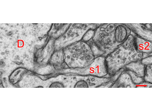

# 08 Segmentation and Proofreading
Technical Training: Nanoscale Connectomics

---

## Learning goals
- Classify merge/split/boundary/identity errors.
- Prioritize high-impact corrections.
- Link corrections to QC metrics and logs.

---

## Why proofreading is scientific QC

- Reconstruction quality bounds analysis validity.

---

## Error taxonomy overview

- Track error classes explicitly in correction logs.

---

## Ultrastructure cues for correction

- Local structure guides boundary decisions.

---

## Synapse-aware review

- Avoid corrections that break plausible synaptic context.

---

## Organelle-assisted disambiguation

- Organellar cues reduce false split/merge decisions.

---

## Comparative ambiguity case

- Similar textures can require different corrections.

---

## Boundary failure case

- Preserve unresolved uncertainty instead of over-correction.

---

## Identity checks (axon/dendrite)

- Identity errors can distort motif and degree statistics.

---

## Edge-case morphology

- Escalate difficult calls to adjudication queue.

---

## QC metrics and release gates

- Report VI, edge precision/recall, ERL, synapse-centric F1.

---

## Activity
Write one correction log with:
- Error type.
- Before/after rationale.
- Metric delta and confidence note.

---

## Attribution
Frompat figures from Pat Rivlin proofreading decks; outreach figures used for processing context.
