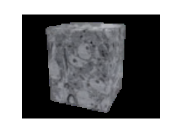
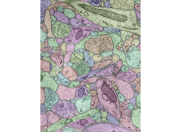
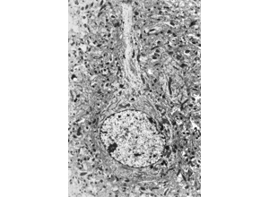
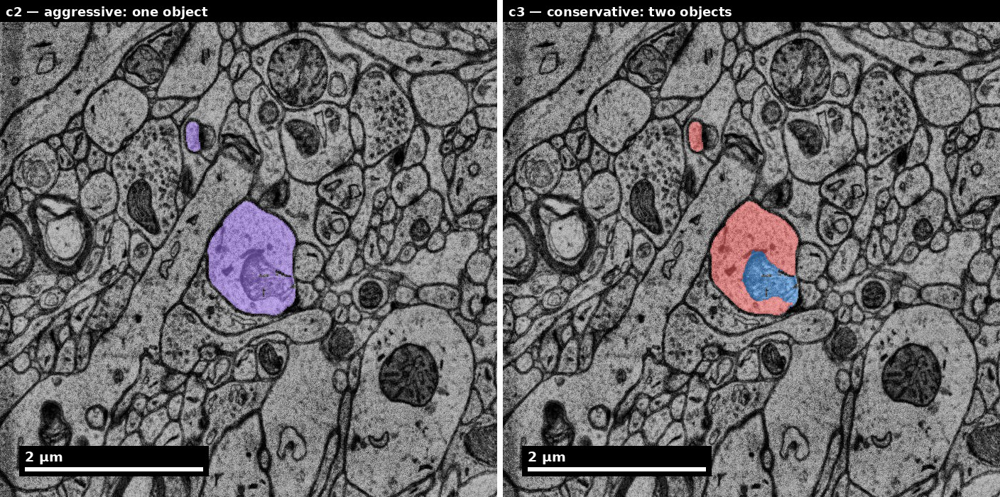
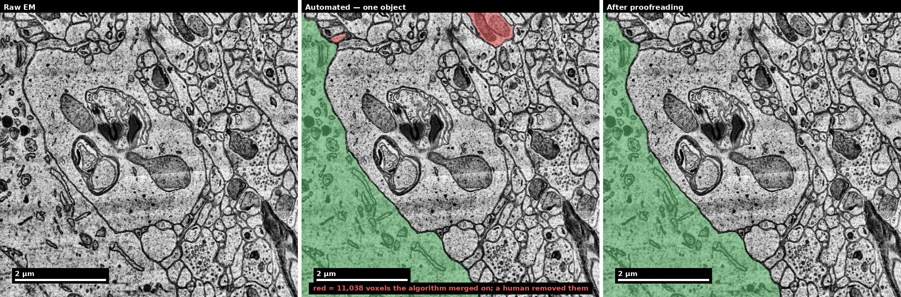
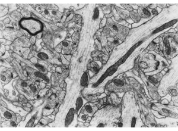
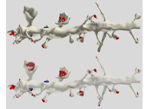
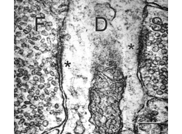
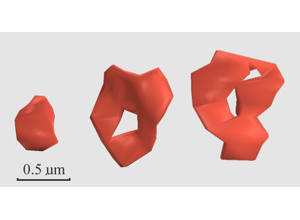
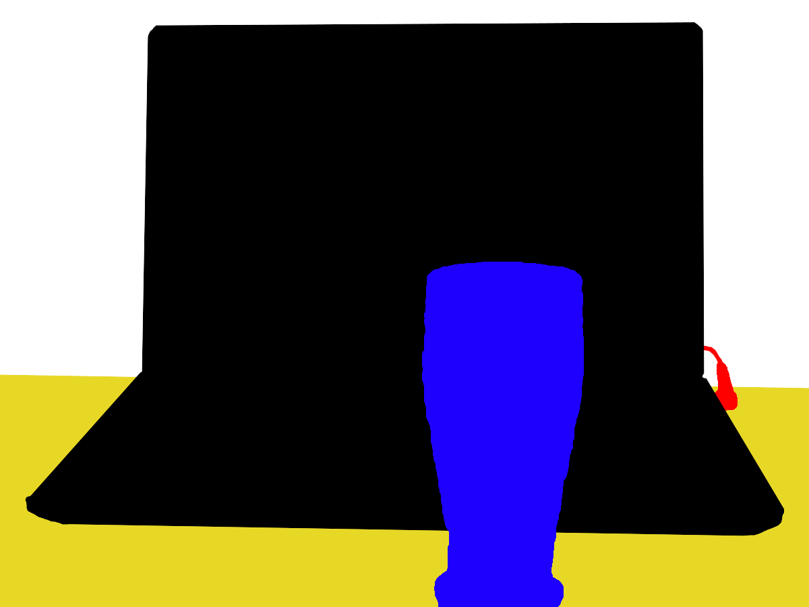

<!-- _class: title nanoscale -->

Human cortex · H01 Object segmentation over electron microscopy

H01 release · Lichtman Lab / Harvard &amp; Connectomics at Google · CC BY 4.0 Shapson-Coe et al. (2024) · doi:10.1126/science.adk4858

<!-- _paginate: skip -->

Technical Course · Unit 08

# Segmentation and Proofreading

Proofreading is allocation under a fixed budget, not cleanup. Rank by effect on the endpoint, not by conspicuousness.

---

## Session outcomes (60 minutes)
- Classify merge, split, boundary, and identity errors reproducibly.
- Prioritize corrections by expected scientific impact.
- Connect proofreading actions to quantitative QC metrics.

---

## Pedagogical arc
- Model: error taxonomy + live correction logic.
- Practice: triage and correction on mixed cases.
- Consensus: adjudicate borderline errors.
- Check: correction log with metric rationale.

---

<!-- _class: figure -->

## Why proofreading is scientific QC

Correction policy determines analysis validity.

Source: assets_outreach source decks, Module14 L2 S03. Historical/context visual.

<!--
Instructor script: "The pipeline is deliberately tuned to over-segment. It prefers splits to merges, because splits are cheaper to repair. That design decision is why proofreading is mostly joining."
Where both segmentation families fail, structurally: thin processes (a 60 nm spine neck may appear in one or two 40 nm sections); steep z-trajectories; tightly apposed membranes under weak staining; artifact regions; rare morphologies — including the boundaries of the volume.
Ask where the measurement points are: a pipeline without a fixed evaluation set of neurons can only report aggregate scores, and aggregate scores are how a merge regression ships.
-->

---

<!-- _class: figure -->

## From voxels to objects

Enforce explicit error-class coding in logs.

Source: assets_outreach source decks, Module14 L2 S08. Historical/context visual.

<!--
Everything upstream of this point is repairable; everything downstream inherits whatever came through. Put the error taxonomy (unit §2) next to it: split, merge, glia–neuron merge, orphan fragment, false synapse, missed synapse, wrong synapse partner.
Instructor script: "Splits are visible and bounded. Merges are invisible and unbounded. A split leaves evidence of itself — a neuron that stops in mid-neuropil. A merge leaves an object that looks like a neuron and is not."
-->

---

<!-- _class: figure -->

## Ultrastructure-informed correction

Before touching anything: what does this correction change about the endpoint, per minute of annotator time?

Source: Pat Rivlin training materials (MICrONS proofreading deck), RIV-ULTRA S06.

<!--
This carries the Unit 05 reading skills into proofreading. Every correction decision ultimately returns to the voxels — a soma, a nucleus, the organelle content on either side of a boundary. Set the frame now: the question about any candidate correction is its effect on the endpoint, not how obvious the error looks.
-->

---

<!-- _class: figure -->

## The merge/split dial, on one real object

H01 ships two agglomerations of the same data: c2 calls this one object; c3 calls it two. Neither is a bug.

Source: H01 release (Lichtman Lab, Harvard; Connectomics at Google), CC BY 4.0 · Shapson-Coe et al. 2024, doi:10.1126/science.adk4858 · site render.

<!--
Across 104 proofread cells, c3 needed 1.6x fewer merge fixes and 2.1x more split fixes than c2. Aggressive agglomeration trades splits for merges; conservative trades merges for splits.
Instructor script: "Which one would you proofread on? It depends on your endpoint. If you are counting inputs per cell, a merge invents inputs; if you are tracing long-range axons, splits cost you the path." Note also what 104 proofread cells out of 16,087 neurons means in practice: most of the volume has never been checked by a human.
-->

---

<!-- _class: figure -->

## Before and after a human fixed it

Green = genuinely this cell. Red = 11,038 voxels the algorithm wrongly absorbed.

Source: H01 release (Lichtman Lab, Harvard; Connectomics at Google), CC BY 4.0 · Shapson-Coe et al. 2024, doi:10.1126/science.adk4858 · site render.

<!--
Instructor script: "The membrane it crossed is real but faint. Would you have caught it?" Give the room ten seconds on the left panel before pointing.
Then the second lesson: note where the error is NOT. At the soma, the automated segmentation needs no correction at all. Errors concentrate at thin processes and faint boundaries, which is why triage should look there rather than where the object is largest.
-->

---

<!-- _class: figure -->

## Synapse-aware correction checks

Apply the Unit 05 synapse criteria before crediting a detection.

Source: Pat Rivlin training materials (MICrONS proofreading deck), RIV-ULTRA S09.

<!--
A synapse assigned to a merged object still scores as correct under synapse precision — exactly what that metric is blind to. False synapses inflate degree and hit weak, one-synapse connections hardest; missed synapses deflate degree non-uniformly by synapse size. Both are found by human verification on a sample, not by browsing.
-->

---

<!-- _class: figure -->

## Checking a reconstruction against plausible morphology

A merged object otherwise looks like a perfectly ordinary neuron.

Source: Pat Rivlin training materials (MICrONS proofreading deck), RIV-ULTRA S11.

<!--
Implausible-morphology detection is how merges get found at all. Automated detectors look for an object with two somata, or with both ribosomes and presynaptic vesicle clusters — the Unit 06 cue-conflict alarm. Humans then adjudicate a ranked queue rather than browsing the volume.
-->

---

<!-- _class: figure -->

## Boundary failure case

Show when to stop and escalate instead of over-correcting.

Source: Pat Rivlin training materials (MICrONS proofreading deck), RIV-ULTRA S23.

<!--
Estimate the cost to fix before committing. A forty-minute trace through a difficult region loses to five five-minute corrections elsewhere — unless the cell is in your analysis set and the error sits near the root of the arbor, where it disconnects everything distal. If the boundary cannot be resolved with the evidence in view, the correct action is to log it with a reason and route it to adjudication.
-->

---

<!-- _class: figure -->

## Identity-sensitive correction context

Every edge direction in the final graph rests on the axon/dendrite call.

Source: Pat Rivlin training materials (MICrONS proofreading deck), RIV-AXDEN S13.

<!--
A reversed edge is not noise: it deletes a true edge and adds its opposite (Unit 06 §4). Audit the edges whose direction would change your conclusion rather than auditing uniformly.
-->

---

## Metrics and release gates: what each one is blind to

| Metric | Blind to |
|---|---|
| **VI** (split + merge components) | Object size; a total can improve while merges get worse |
| **ERL** | Merges, unless explicitly penalized |
| **Edge precision / recall** | Weights a 1-synapse and a 50-synapse edge equally |
| **Synapse F1** | Assumes correct segmentation underneath |

<!--
Rule from unit §3: use at least two metrics from different rows, and always report VI's split and merge components separately. A single VI number can improve while merges get worse, because the split component dominates — a real and common way to ship a regression.
Then the metric that actually matters: the effect on your endpoint. Take a random 20-cell sample, proofread it exhaustively, recompute the endpoint, report the shift. "Exhaustive proofreading of a 20-cell sample changed the ratio from 3.1 to 2.8" says more about data quality than any VI value.
-->

---

## Operational proofreading loop
1. Triage by expected downstream impact.
2. Correct with local + global consistency checks.
3. Update targeted metrics.
4. Route unresolved cases for adjudication.
5. Gate release on predefined thresholds.

<!--
Work the unit's triage example with one annotator-hour. A: a split near the soma of an analysis-set cell, ~60% of the arbor, 10 min. B: a glia–neuron merge on another analysis-set cell, 20 min. C: a conspicuous two-soma merge on cells outside the analysis set, 15 min.
Check C's partner lists first (2 min) — it could corrupt the endpoint indirectly if either fused neuron is presynaptic to an analysis cell. It is not. Then B before A: an unfixed A delays a cell; an unfixed B poisons one. Spend the remaining time on the next analysis-set candidates, not on C.
Stopping rules must be stated in advance, measurable and tied to the endpoint. The strongest: stop when a second independent pass over a 20-cell sample changes the endpoint by less than 5%.
-->

---

## Misconceptions to correct
- "Fix easiest errors first."
- "Global metric improvements guarantee biological validity."
- "Automation removes need for human policy."

---

## Activity
Submit one correction log containing:
- error class,
- before/after rationale,
- metric impact expectation,
- confidence and escalation status.

<!--
Every edit records who, when, what and ideally why. That record is what lets you roll back a bad batch, spot one annotator's systematic drift, and reconstruct the state of an analysis at any past time.
-->

---

## Rubric checkpoint
- Pass: correction decision tied to error class and metric logic.
- Strong: priority ranking aligned to scientific impact.
- Flag: edits without audit trail or rationale.

---

## Segmentation outside neuroscience, for intuition

 

An image and its segmentation: every pixel assigned to exactly one object.

Source: Wikimedia Commons, File:Image-segmentation-example.jpg and File:Image-segmentation-example-segmented.png. CC0 1.0.

---

## References and attribution
- Figures RIV-*: Pat Rivlin training materials (MICrONS proofreading deck); Module14 L2: assets_outreach source decks.
- Real-data figures: H01 release, Shapson-Coe et al. (2024), doi:10.1126/science.adk4858.
- Januszewski et al. (2018), *Nature Methods*, doi:10.1038/s41592-018-0049-4 — flood-filling networks.
