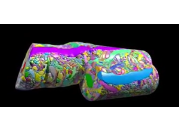
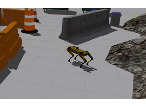
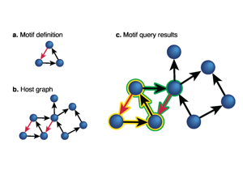
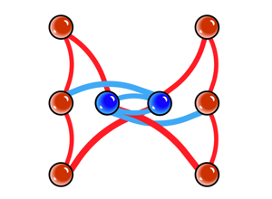
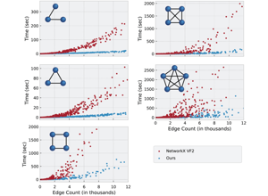
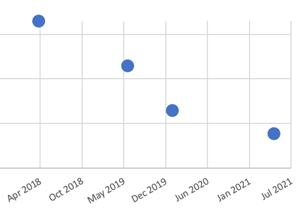
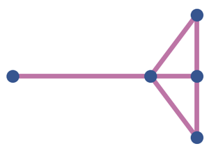
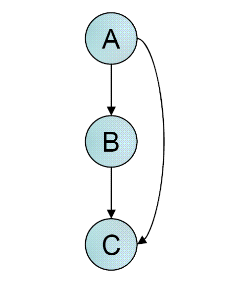

# 09 Connectome Analysis and NeuroAI
Technical Training: Nanoscale Connectomics

---

## Session outcomes (60 minutes)
- Formulate a motif/graph hypothesis with explicit estimand.
- Choose and justify a null model.
- Report bounded claims with uncertainty and reproducibility metadata.

---

## Pedagogical arc
- Hook: why graph/motif results are often overclaimed.
- Model: hypothesis -> query -> null -> interpretation.
- Practice: design and critique analysis plans.
- Check: one bounded claim + non-claim pair.

---

## Motivation and framing

- Structure can constrain models; it does not automatically explain intelligence.

---

## Representation framing

- Define representation before inference.

---

## Limits of reverse engineering claims

- Teach boundary statements as required output.

---

## Analysis workflow overview

Hypothesis -> Query -> Search -> Null comparison -> Interpretation -> Reproducibility package

---

## Motif search context

- Distinguish candidate motifs from validated mechanisms.

---

## Query language and reproducibility

- Human-readable queries reduce hidden assumptions.

---

## Complexity constraints and feasibility

- Computational limits are part of methodological validity.

---

## Historical benchmark caution

- Use old benchmark values as context, not current truth.

---

## Comparative analysis caveats

- Cross-dataset claims require aligned preprocessing and null assumptions.

---

## Misconceptions to correct
- "Significant motif enrichment implies mechanism."
- "One null model is enough for any claim."
- "Query scripts without provenance are acceptable."

---

## Activity
Design one analysis card with:
- hypothesis,
- estimand,
- null model,
- success criterion,
- non-claim,
- provenance fields.

---

## Rubric checkpoint
- Pass: coherent hypothesis-null-estimand chain.
- Strong: includes sensitivity analysis and boundary statement.
- Flag: result-first narrative without methodological controls.

---

## External paper figure integration
- Bassett, Zurn, Gold 2018 (model taxonomy and claim type framing).
- Large-scale connectome motif-analysis papers with null-model details.
- Graph-method papers showing sensitivity to preprocessing choices.

---

## External inserted figure (open license)

- Source URL: https://commons.wikimedia.org/wiki/Special:FilePath/Feed-forward_motif.GIF
- License: CC BY-SA 3.0 (Wikimedia Commons feed-forward motif asset).

---

## References and attribution
- Internal visuals: outreach/neuroAI historical deck assets.
- Journal-club tie-ins:
  - https://doi.org/10.1038/s41592-018-0049-4
  - https://doi.org/10.1038/s41583-018-0038-8
