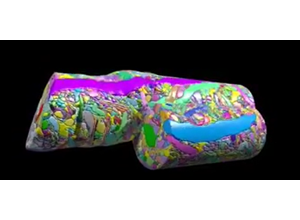
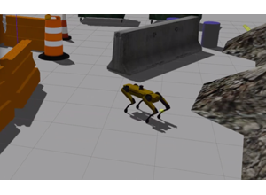
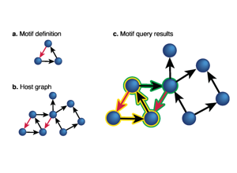
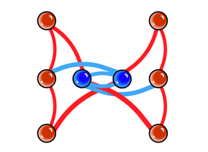
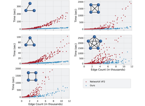
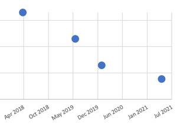
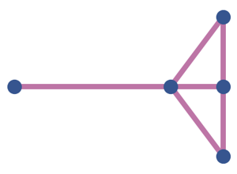
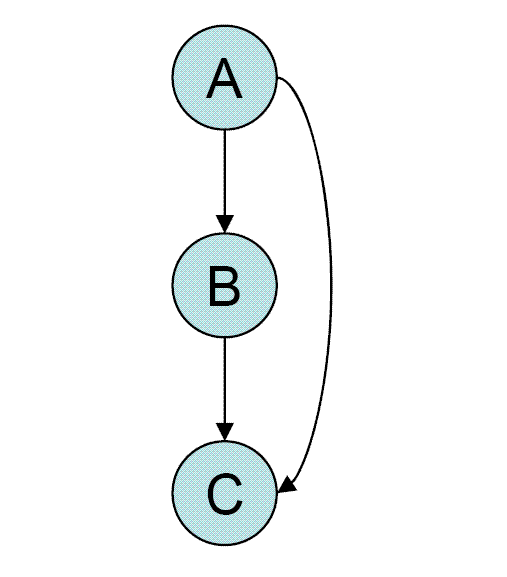

<!-- _class: title nanoscale -->

Human cortex · H01 Object segmentation over electron microscopy

H01 release · Lichtman Lab / Harvard &amp; Connectomics at Google · CC BY 4.0 Shapson-Coe et al. (2024) · doi:10.1126/science.adk4858

<!-- _paginate: skip -->

Technical Course · Unit 09

# Connectome Analysis and NeuroAI

Choosing the null is the scientific step; running the test is bookkeeping.

---

## Session outcomes (60 minutes)
- Formulate a motif/graph hypothesis with explicit estimand.
- Choose and justify a null model.
- Report bounded claims with uncertainty and reproducibility metadata.

---

## Pedagogical arc
- Hook: why graph/motif results are often overclaimed.
- Model: hypothesis -> query -> null -> interpretation.
- Practice: design and critique analysis plans.
- Check: one bounded claim + non-claim pair.

---

<!-- _class: figure -->

## Motivation and framing

Structure can constrain models; it does not automatically explain intelligence.

Source: neuroAI source deck (2021 techtalk), Techtalk S10. Historical/context visual.

<!--
Instructor script: "Hold this motivating question against an asymmetry. So far machine learning has given connectomics far more than the reverse: dense segmentation, synapse detection, error detection and proofreading candidate generation are all learned systems, and none of the petascale datasets would exist without them. Say that plainly when you write about NeuroAI."
-->

---

<!-- _class: figure -->

## Representation framing

Define representation before inference.

Source: neuroAI source deck (2021 techtalk), Techtalk S11. Historical/context visual.

<!--
Before any statistic, six construction choices (unit §1): what is a node (cell, type, compartment); what is an edge (and its synapse threshold); what is the weight; is it directed; which cells are included; where is the boundary. Each changes the answer. A graph is a versioned artifact with recorded parameters, not a script someone ran once. Inclusion criteria are the highest-leverage and least-reported of the six.
-->

---

<!-- _class: figure -->

## Limits of reverse-engineering claims

Teach boundary statements as required output.

Source: neuroAI source deck (2021 techtalk), Techtalk S12. Historical/context visual.

<!--
What a connectome does not give machine learning (unit §5): not weights — synapse count is a proxy for strength, and sign, short-term dynamics, plasticity state and neuromodulatory context are absent; not dynamics — a static diagram from one animal at one moment; not a runnable brain; and not, so far, a competitive advantage in mainstream deep learning.
-->

---

<!-- _class: figure -->

## From connectome to model: the strongest claim available

Hypothesis → query → null comparison → interpretation → reproducibility package.

Source: neuroAI source deck (2021 techtalk), Techtalk S13. Historical/context visual.

<!--
The image is the techtalk's framing of an embodied agent; the teaching point is the pipeline beneath it. The strongest current result type is a connectome-constrained model: fix connectivity from the measurement, fit what remains, predict responses that are then tested. This has been done in the fly visual system. In that version the connectome removes free parameters, and removing them is what makes the model falsifiable.
-->

---

<!-- _class: figure -->

## Motif search context

A motif definition, a host graph, and the query results. Candidate motifs are not validated mechanisms.

Source: neuroAI source deck (2021 techtalk), Techtalk S24. Historical/context visual.

<!--
A motif is enriched only relative to a null. Ask what would count as the uninteresting explanation — degree heterogeneity, spatial proximity or cell-type composition — and require the null to preserve it.
Worked example (unit §2): 100 neurons, 1,200 edges, 210 reciprocal pairs. Erdős–Rényi expects 72.7 -> 2.9x enrichment. Degree-preserving expects ~150 -> 1.4x, z = 5.0. Degree- and distance-preserving expects ~185 -> 1.14x, z = 1.8, p ~ 0.07. Same data: "2.9-fold enrichment, p < 10^-6" or "no detectable effect", depending on a choice made before any test ran. Pre-register the null, or report under all three.
-->

---

<!-- _class: figure -->

## A motif, written as a reviewable query

Human-readable queries reduce hidden assumptions.

Source: neuroAI source deck (2021 techtalk), Techtalk S42. Historical/context visual.

<!--
The real value of a declarative motif query is that the motif definition becomes an explicit, reviewable artifact instead of a description in prose — which turns "pre-register the motif and the null" into a practical instruction. Note what it does not do: it returns counts against whatever graph you built, carrying every construction choice, including a synapse threshold that may have quietly removed most of your edges.
-->

---

<!-- _class: figure -->

## Complexity constraints and feasibility

Search time against edge count for several motifs. Computational limits are part of methodological validity.

Source: neuroAI source deck (2021 techtalk), Techtalk S31. Historical/context visual.

<!--
Subgraph isomorphism is the computational core, but in practice the hard part is statistical rather than algorithmic. There are 16 directed triad classes; testing all 16 at alpha = 0.05 expects about one false positive, and triad counts are strongly correlated with one another — so treating them as independent overstates confidence. That argues for permutation-based inference, which respects the dependence. Report how many tests you ran, including the ones you did not report.
-->

---

<!-- _class: figure -->

## Historical benchmark caution

Use old benchmark values as context, not current truth.

Source: neuroAI source deck (2021 techtalk), Techtalk S32. Historical/context visual; benchmark claims are historical unless independently revalidated.

<!--
Read benchmarks the way the atlas advises: scores on small, clean volumes systematically overstate performance on production data with artifacts, rare morphologies and volume boundaries. The question for a project is not leaderboard position but error rate on your tissue — a pilot sub-volume of your own data.
-->

---

<!-- _class: figure -->

## Comparative analysis caveats

Cross-dataset claims require aligned preprocessing and null assumptions.

Source: neuroAI source deck (2021 techtalk), Techtalk S44. Historical/context visual.

<!--
Comparisons are the most durable result type in this field — across development, as in the C. elegans developmental series, or across species — because a shared reconstruction bias partly cancels between the two sides. The condition is that both sides were built with the same construction parameters and, where relevant, the same materialization version; otherwise the comparison measures the pipeline rather than the biology.
-->

---

## The error-sensitivity check you should always run
1. State your measured merge and split rates (Unit 08 validation).
2. Apply merges and splits at those rates, under a stated error model.
3. Recompute the motif statistic across many perturbed graphs.
4. Report the spread as a sensitivity band on the effect size.

<!--
Why this matters: a merge combines two partner lists, which can add, collapse or redirect edges; a split removes or redistributes them. Whether a given motif count rises or falls depends on the motif and the construction rules, so do not assume the two cancel or push in one fixed direction. Simulating your own measured rates is the only way to know which way your statistic moves (Module 9, slide 36).
Instructor script: "If the band crosses the null expectation, your result is not robust to your own measured error rate. Say so before a reviewer does. It is a few dozen lines of code."
-->

---

## Misconceptions to correct
- "Significant motif enrichment implies mechanism."
- "One null model is enough for any claim."
- "Query scripts without provenance are acceptable."

<!--
On the second: someone objects that a distance-preserving null "throws away the biology". It depends on the hypothesis. Testing for specific reciprocal wiring beyond generic spatial structure: control distance. Comparing reciprocity between two circuits: a within-circuit distance null may over-control. Asking what generates the reciprocity: compare generative models rather than pick one null. Write out in words what would count as the uninteresting explanation before choosing.
-->

---

## Activity
Design one analysis card with:
- hypothesis,
- estimand,
- null model,
- success criterion,
- non-claim,
- provenance fields.

---

## Rubric checkpoint
- Pass: coherent hypothesis-null-estimand chain.
- Strong: includes sensitivity analysis and boundary statement.
- Flag: result-first narrative without methodological controls.

---

<!-- _class: figure -->

## The feed-forward motif

One of the 16 directed triad classes, drawn on its own.

Source: Wikimedia Commons user Marashie, File:Feed-forward_motif.GIF. CC BY-SA 3.0.

---

## References and attribution
- Figures: 2021 neuroAI techtalk (historical/context visuals); interpret benchmark claims as historical.
- Januszewski et al. (2018), *Nature Methods*, doi:10.1038/s41592-018-0049-4.
- Bassett, Zurn & Gold (2018), *Nature Reviews Neuroscience*, doi:10.1038/s41583-018-0038-8 — model types and claim framing.
