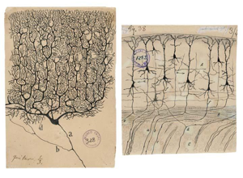

# Atlas Connectomics Reference
Technical Training: Nanoscale Connectomics

---

## Purpose
Operational reference system for papers, datasets, tools, and media mapped to real workflow decisions.

---

## Session outcomes
- Curate references with metadata that supports action, not just citation.
- Map each item to a workflow stage and decision context.
- Flag evidence limits and maturity for safe reuse.

---

## Why atlas quality matters
- Weak metadata creates "citation theater" without reproducibility.
- Strong metadata shortens onboarding and improves journal-club depth.
- A good atlas makes hidden curriculum explicit.

---

## Visual context: taxonomy framing

---

## Visual context: reference-to-workflow mapping

---

## Visual context: comparative resource panel

---

## Required metadata schema
- citation and access link
- workflow stage (acquisition/reconstruction/proofreading/analysis/cross-cutting)
- modality + resolution + scale
- access level and licensing notes
- maturity (prototype/validated/production)
- known limitations and failure cases
- mapped training units

---

## Curation principles
- Prefer resources with reusable artifacts (code/data/protocols).
- Label historical resources explicitly as historical.
- Remove dead links rapidly and retain change log.
- Prioritize balance across stages (avoid analysis-only bias).

---

## Instructor move: quality triage drill
Learners compare two references and decide which one is "operationally reusable" and why.

---

## Activity
Curate one atlas entry with complete metadata and:
- one explicit limitation,
- one recommended use-case,
- one anti-use-case.

---

## Rubric checkpoint
- Pass: complete schema + limitation statement.
- Strong: stage mapping + decision-use context are explicit.
- Flag: bibliographic completeness without operational details.

---

## External sources to seed atlas
- Foundational dense reconstruction papers.
- Large-scale platform/infrastructure papers.
- Proofreading/QC metrics papers.
- Connectome analysis + null-model methodology papers.

---

## Wrap
Atlas maintenance should drive updates to journal club, technical units, and assessment prompts.
