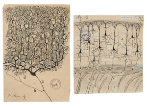
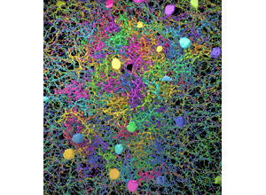
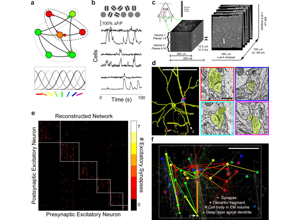

<!-- _class: title nanoscale -->

Human cortex · H01 Object segmentation over electron microscopy

H01 release · Lichtman Lab / Harvard &amp; Connectomics at Google · CC BY 4.0 Shapson-Coe et al. (2024) · doi:10.1126/science.adk4858

<!-- _paginate: skip -->

Technical Course · Reference

# Connectomics Reference Atlas

A lookup table, not a lesson: which dataset, which tool, which benchmark — and how to add an entry that someone else can act on.

---

## Purpose
Operational reference system for papers, datasets, tools, and media mapped to real workflow decisions.

<!--
The atlas page answers four questions: which public dataset can answer my question; what tool I need at this pipeline stage; how to evaluate a segmentation method; how to add something to the atlas. Specifications there are as published and approximate where releases have been revised — always confirm current figures and access terms against the primary source before citing, because dataset sizes change as proofreading continues.
-->

---

## Session outcomes
- Curate references with metadata that supports action, not just citation.
- Map each item to a workflow stage and decision context.
- Flag evidence limits and maturity for safe reuse.

---

## Why atlas quality matters
- Weak metadata creates "citation theater" without reproducibility.
- Strong metadata shortens onboarding and improves journal-club depth.
- A good atlas makes hidden curriculum explicit.

<!--
Instructor script: "Before proposing new acquisition, check the atlas. Many good connectomics questions can be answered by reanalyzing existing public data. Acquiring a new mm-scale volume is a multi-year, multi-million-dollar program; reanalyzing one is a compute bill and your time."
Quick map from the page's choosing table: whole-brain graph structure -> FlyWire or larval Drosophila; clean cell-type connectivity -> hemibrain; structure–function -> MICrONS; human-specific features -> H01; development -> the C. elegans developmental series; what dense reconstruction requires -> Kasthuri 2015.
-->

---

<!-- _class: figure -->

## Where the reference stream starts

Deck context, not reference material: treat any figure it carries as provisional.

Source: module14 lesson3 source deck, Module14 L3 S03-02. Historical/context visual.

<!--
The atlas page is explicit that this panel is deck context and nothing in it should be cited. Use it to rehearse the habit the atlas asks for: volume sizes, cell counts and synapse counts in this field are release-dependent, so confirm every specification against the primary source (Unit 04 §2).
-->

---

<!-- _class: figure -->

## Reference-to-workflow mapping

For each resource you name, could you write its <code>known_limits</code> sentence?

Source: module14 lesson3 source deck, Module14 L3 S10. Historical/context visual.

<!--
The known_limits field is the one most often left blank and the one most worth filling. Instructor script: "An atlas of tools without limits is advertising." Pick one resource from the page's software table — CloudVolume, caveclient, CATMAID, DotMotif — and write its limit sentence together before the activity.
-->

---

<!-- _class: figure -->

## Comparative resource panel

Functional recordings, the reconstructed network, and the rendered circuit are three views of one dataset. An atlas entry has to say which view it indexes.

Source: module14 lesson3 source deck, Module14 L3 S13. Historical/context visual.

<!--
Use the panel to motivate the modality and effective_resolution fields: a dataset that pairs functional imaging with EM reconstruction (MICrONS is the reference case today) needs its entry to say which product a user is being pointed at — the calcium traces, the connectivity matrix, or the volume — because access, licensing and maturity differ between them.
-->

---

## Required metadata schema
- citation and access link
- workflow stage (acquisition/reconstruction/proofreading/analysis/cross-cutting)
- modality + resolution + scale
- access level and licensing notes
- maturity (prototype/validated/production)
- known limitations and failure cases
- mapped training units

<!--
The page's field names, for learners who will contribute: citation (with DOI), workflow_stage, species and brain_region, modality and effective_resolution, dataset_or_code_access (open / registration / request), maturity (concept / validated prototype / production-validated), known_limits, mapped_units.
-->

---

## Curation principles
- Prefer resources with reusable artifacts (code/data/protocols).
- Label historical resources explicitly as historical.
- Remove dead links rapidly and retain change log.
- Prioritize balance across stages (avoid analysis-only bias).

<!--
Two principles from the page worth stressing. Mark superseded methods as historical rather than deleting them when they remain pedagogically useful — the history of a method often explains its assumptions. And every entry links to at least one unit, so the atlas stays connected to teaching rather than becoming an orphaned bibliography.
-->

---

## Instructor move: quality triage drill
Learners compare two references and decide which one is "operationally reusable" and why.

<!--
A pairing that works: a benchmark leaderboard entry against a released dataset with a client library. Benchmarks on small, well-prepared volumes systematically overstate performance on production data; a released dataset with a pinned version and a client is something a learner can act on tomorrow.
-->

---

## Activity
Curate one atlas entry with complete metadata and:
- one explicit limitation,
- one recommended use-case,
- one anti-use-case.

---

## Rubric checkpoint
- Pass: complete schema + limitation statement.
- Strong: stage mapping + decision-use context are explicit.
- Flag: bibliographic completeness without operational details.

<!--
"Strong" on the page's rubric: the limitation sentence is specific enough that a reader could predict a failure case from it, and the unit mapping says where in that unit's workflow the resource fits.
-->

---

## Sources to seed the atlas
- Kasthuri et al. (2015), *Cell*, doi:10.1016/j.cell.2015.06.054 — dense reconstruction.
- Dorkenwald et al. (2024), *Nature*, doi:10.1038/s41586-024-07558-y — community-proofread platform.
- Januszewski et al. (2018), *Nature Methods*, doi:10.1038/s41592-018-0049-4 — segmentation.
- Bassett, Zurn & Gold (2018), *Nat Rev Neurosci*, doi:10.1038/s41583-018-0038-8 — models and claims.

---

## Wrap
Atlas maintenance should drive updates to journal club, technical units, and assessment prompts.
