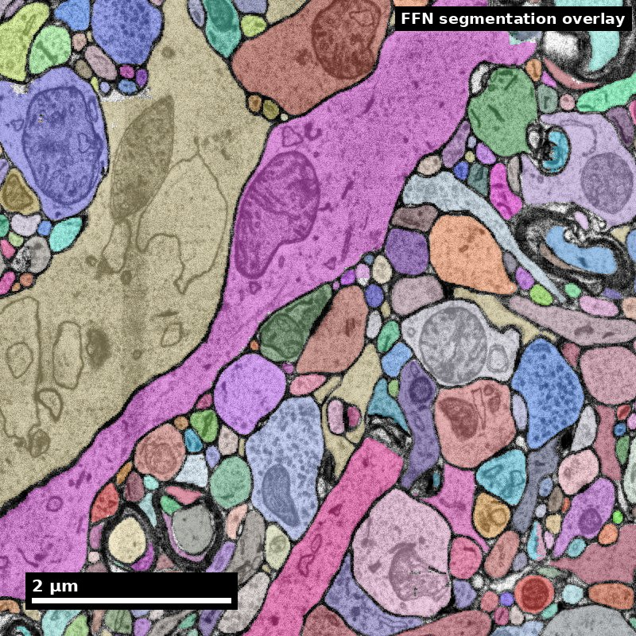

<!-- _class: title nanoscale -->

NeuroTrailblazers · Module 16

# Scientific Visualization for Connectomics
Teaching Deck

Human cortex · H01 Object segmentation over electron microscopy

H01 release · Lichtman Lab / Harvard &amp; Connectomics at Google · CC BY 4.0 Shapson-Coe et al. (2024) · doi:10.1126/science.adk4858

---

## Learning Objectives
- Select visualization forms aligned to analytical intent
- Encode uncertainty and quality signals explicitly
- Avoid misleading visual encodings in dense connectomics data
- Produce publication-ready and presentation-ready figures

---

## Session Outcomes
- Learners can complete the module capability target.
- Learners can produce one evidence-backed artifact.
- Learners can state one limitation or uncertainty.

---

## Capability Target
Produce a figure set that communicates connectomics findings accurately, including uncertainty and data-quality context, for both expert and mixed audiences. Students will leave this module able to choose the right visualization form for a given scientific claim, build publication-quality figures using standard tools, and defend every design choice in terms of clarity and honesty.

---

## Concept Focus
### 1) Visualization as communication, not decoration
- **Technical:** every visual encoding (position, color, size, shape, opacity) carries information. Encodings that do not map to data dimensions are noise. The goal of a scientific figure is to make the reader's correct interpretation as effortless as possible.
- **Plain language:** a figure should help people understand your result, not impress them with complexity.
- **Misconception guardrail:** a figure that looks good is a figure that tells the truth.
- **Why it fails:** a polished 3D rendering with no scale bar and no uncertainty indicator tells the reader less than a plain but complete 2D plot.

---

## Core Workflow
- **Map each claim to required visual evidence.** For every result sentence, identify what figure panel and what visual encoding will support it.
- **Select the appropriate plot type.** Use the decision framework: topology questions get node-link diagrams or matrices; quantity questions get heatmaps or bar charts; spatial questions get renderings; distribution questions get histograms or violins.
- **Draft candidate visuals with uncertainty layers.** Include error bars, confidence bands, or explicit missing-data indicators from the start --- do not plan to "add them later."

---

## Core Workflow (continued)
- **Run critique for misinterpretation risk.** Show the draft to someone unfamiliar with the analysis and ask them what they conclude. If their conclusion differs from your intent, revise.
- **Check accessibility.** Run the figure through a colorblind simulator (e.g., Coblis, or a Python library such as colorspacious). Verify grayscale legibility.
- **Revise for clarity, accessibility, and reproducibility.** Add scale bars, axis labels, panel letters, and complete captions.

---

## Core Workflow (continued)
- **Export figure package with caption metadata.** Include figure files at publication resolution (300+ DPI for raster, vector preferred), caption text, and a note on the dataset version and code used to generate each panel.

---

## Run of Show (60 min)
- 00:00-10:00 | Visual integrity gallery walk
- 10:00-20:00 | Claim-to-visual mapping exercise
- 20:00-35:00 | Figure draft build
- 35:00-47:00 | Uncertainty and quality overlays
- 47:00-55:00 | Peer critique and revision
- 55:00-60:00 | Competency check and wrap-up

<!--
Materials needed
  Projected examples: 3 good and 3 bad connectomics figures (prepared in advance from published papers or synthetic examples).
  Shared dataset: the [Module 16 kit](/assets/kits/module16/README.md) (synthetic). Use a 20 x 30 block of its cell-type matrix and the `excitatory.swc` skeleton for the Sholl plot.
  Software: Matplotlib or Plotly in a notebook each learner starts; [MICrONS Explorer](https://www.microns-explorer.org/) open for the 3D context view.
  Colorblind simulation tool (browser-based), such as [Coblis](https://www.color-blindness.com/coblis-color-blindness-simulator/).
  Printed or digital critique rubric (one per student): the four questions in the 47:00-55:00 block below.
  Timing and instructor script

00:00-10:00 | Visual integrity gallery walk
  Instructor displays six figures (three strong, three weak) without labels. Students vote on which are "trustworthy" and which are "suspicious." Instructor reveals issues: missing scale bars, rainbow colormaps, cluttered node-link diagrams, hidden uncertainty, gratuitous 3D. Key script line: "Your first instinct about a figure's trustworthiness is often right. Now name the feature that triggered it."

10:00-20:00 | Claim-to-visual mapping exercise
  Instructor presents three scientific claims from a mock connectomics study:
  "Excitatory neurons in layer 4 receive more synaptic input than those in layer 2/3."
  "Reciprocal connections are enriched between Martinotti cells."
  "Axonal arbors of chandelier cells are spatially restricted to a 100-micron radius."
  Students work in pairs to select the best plot type for each claim and justify their choice. Instructor circulates, challenging choices: "Why not a node-link diagram for claim 1? What would you lose with a heatmap for claim 3?"

20:00-35:00 | Figure draft build
  Students open a notebook, load the kit files, and generate: (a) an adjacency heatmap for the cell-type connectivity matrix, (b) a Sholl plot for the kit's excitatory neuron. Instructor models adding axis labels, a perceptually uniform colormap, and a scale bar. Students replicate and customize.

35:00-47:00 | Uncertainty and quality overlays
  Instructor demonstrates adding confidence intervals to the Sholl plot and a "data quality" overlay to the heatmap (hatching for cell-type pairs with fewer than 5 observed connections). Students add these to their own figures. Key script line: "If you cannot see the uncertainty, you cannot evaluate the claim."

47:00-55:00 | Peer critique and revision
  Students swap figures with a neighbor and complete the critique rubric: Does the figure support the stated claim? Is uncertainty visible? Could it be misinterpreted? Is it colorblind-safe? Students revise based on feedback.

55:00-60:00 | Competency check and wrap-up
  Each student submits one revised figure with a two-sentence caption. Instructor reviews one or two examples live, highlighting what works and what still needs improvement.
  Success criteria for this session
  Every student figure includes at least one uncertainty indicator.
  Captions specify dataset version and analysis parameters.
  No figure uses a rainbow/jet colormap.
-->

---

## Misconceptions to Watch
- **Misconception guardrail:** a figure that looks good is a figure that tells the truth.
- **Misconception guardrail:** each data type has one best chart.
- **Misconception guardrail:** a more complex figure shows a more rigorous analysis.
- **Misconception guardrail:** removing error bars makes a plot cleaner and therefore better.
- **Misconception guardrail:** if the figure reads well on your screen, it reads well for everyone.

---

## Studio Activity
**Scenario:** You are preparing a three-figure package for a short connectomics paper reporting cell-type-specific connectivity patterns in a cortical volume. Your dataset includes a 50x50 cell-type adjacency matrix, morphological reconstructions for three example neurons, and synapse count distributions across layers (all synthetic, in the [Module 16 kit](/assets/kits/module16/README.md)).

---

## Activity Output Checklist
- Evidence-linked artifact submitted.
- At least one limitation or uncertainty stated.
- Revision point captured from feedback.

---

## Assessment Rubric
- **Minimum pass:** visuals map clearly to claims, include uncertainty context, use perceptually uniform colormaps, and have complete axis labels and scale bars.
- **Strong performance:** high clarity across expert and non-expert audiences, minimal misinterpretation risk, colorblind-safe design, explicit documentation of dataset version and code used for each panel, and thoughtful caption language that narrows interpretation bounds.
- **Failure modes:** overloaded figures with too many overlapping elements, missing scale context, hidden uncertainty, rainbow colormaps, gratuitous 3D renderings, captions that do not mention data quality or limitations.

---

## Exit Ticket
Take one existing connectomics figure (from a paper, a classmate, or your own work) and perform a full audit:
1. Identify the claim the figure is supposed to support.
2. Add one uncertainty cue (error bar, confidence band, or missing-data indicator).
3. Replace the colormap with a perceptually uniform alternative if needed.
4. Write a two-sentence caption that narrows interpretation bounds and specifies the dataset version.
5. Run the figure through a colorblind simulator and note any issues.

---

## References (Instructor)
- Tufte ER (1983) The Visual Display of Quantitative Information. Graphics Press.
- Borland D, Taylor RM (2007) Rainbow color map (still) considered harmful. IEEE Computer Graphics and Applications 27(2):14-17.
- Weissgerber TL et al. (2015) Beyond bar and line graphs: time for a new data presentation paradigm. PLoS Biology 13(4):e1002128.

---

## Teaching Materials
- Module page: /modules/module16/
- Session kit: /teaching/sessions/module16/
- Worksheet: /assets/worksheets/module16/module16-activity.md
