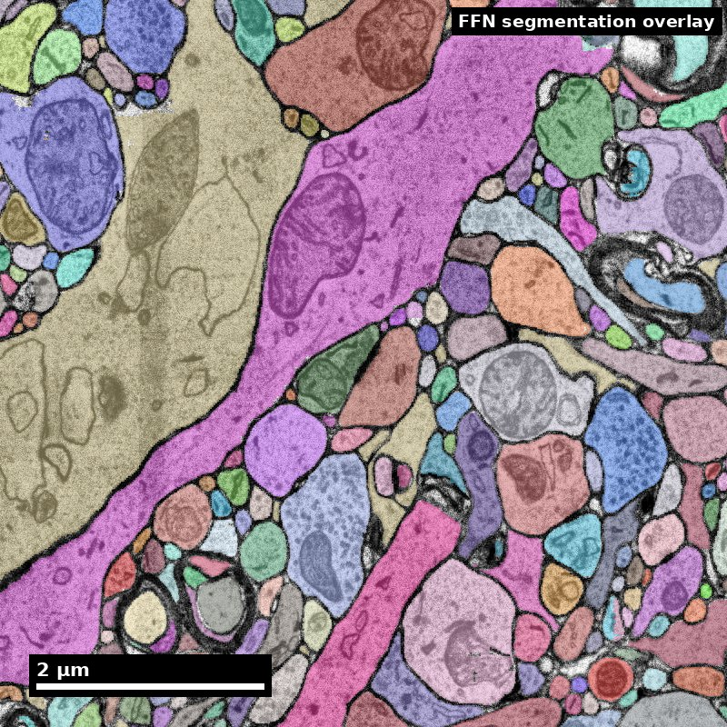

<!-- _class: title nanoscale -->

NeuroTrailblazers · Module 20

# Statistical Models and Inference for Connectomics
Teaching Deck

Human cortex · H01 Object segmentation over electron microscopy

H01 release · Lichtman Lab / Harvard &amp; Connectomics at Google · CC BY 4.0 Shapson-Coe et al. (2024) · doi:10.1126/science.adk4858

---

## Learning Objectives
- Choose statistical models aligned to connectomics question types
- Construct and justify appropriate null models for graph analyses
- Control multiplicity and uncertainty in high-dimensional motif tests
- Report inferential claims with explicit assumptions and limits

---

## Session Outcomes
- Learners can complete the module capability target.
- Learners can produce one evidence-backed artifact.
- Learners can state one limitation or uncertainty.

---

## Capability Target
Design and execute a connectomics inference plan that includes null-model choice, multiplicity control, uncertainty reporting, and explicit claim boundaries.

---

## Concept Focus
### 1) Null models encode scientific assumptions
- **Technical:** null models should preserve relevant graph constraints (degree sequence, spatial limits, cell-class composition) while randomizing the tested structure.
- **Plain language:** your "chance baseline" must reflect biology and data collection realities.
- **Misconception guardrail:** a generic random graph is an adequate null for a connectome.
- **Why it fails:** a null that ignores degree and distance is beaten by almost any real graph, so the enrichment is a fact about the null, not the circuit. Preserve the constraints your hypothesis takes for granted and randomize only the structure you are testing.

---

## Core Workflow
- **Question-to-test mapping**
- Convert biological question into estimand(s), test set, and effect-size target.
- **Null-model design**
- Define null constraints and why they preserve key confounders.
- **Inference execution**
- Run model/tests with preregistered thresholds and multiplicity controls.

---

## Core Workflow (continued)
- **Robustness checks**
- Test sensitivity to preprocessing variant, sampling region, and parameter choice.
- **Claim calibration**
- Report supported, uncertain, and unsupported claims in separate blocks.

---

## Run of Show (60 min)
- 00:00-06:00 | Framing: the null is the scientific step
- 06:00-18:00 | Worked example: reciprocity across nulls
- 18:00-30:00 | Guided practice: write the uninteresting explanation
- 30:00-40:00 | Multiplicity
- 40:00-50:00 | Robustness and error sensitivity
- 50:00-57:00 | Competency check
- 57:00-60:00 | Exit ticket

<!--
Pre-class preparation (15 min async)
  Read section 2 of [Technical Unit 09](/technical-training/09-connectome-analysis-neuroai/), the worked reciprocity example across three null models.
  Bring one motif or connectivity claim from a paper you have read, with its stated null.
  Minute-by-minute plan

00:00-06:00 | Framing: the null is the scientific step
  Prompt: "Same graph, same motif, three null models, three different conclusions. Which one is right?"
  Establish that the answer depends on what the hypothesis treats as uninteresting.

06:00-18:00 | Worked example: reciprocity across nulls
  Instructor works the Unit 09 example live: 100 neurons, 1,200 edges, 210 reciprocal pairs.
  Erdos-Renyi gives 2.9x. Degree-preserving gives 1.4x. Degree-and-distance gives 1.14x, not significant.
  Think aloud about which null matches which hypothesis, not which gives the nicer number.

18:00-30:00 | Guided practice: write the uninteresting explanation
  In pairs, learners take their brought-in claim and write, in words, the sentence "this result would be uninteresting if ___".
  Then name the null that preserves exactly that.
  Instructor circulates asking "what does your null preserve, and what does it randomize?"

30:00-40:00 | Multiplicity
  Count the tests actually run, including unreported ones. Choose a correction and justify it.
  Surface the dependence problem: triad counts move together, so analytic p-values overstate confidence. Permutation inference respects the dependence.

40:00-50:00 | Robustness and error sensitivity
  Each learner names one preprocessing choice (synapse threshold, inclusion criteria, boundary handling) and states how they would test sensitivity to it.
  Introduce the error-simulation check: perturb the graph at measured merge and split rates, report the band.

50:00-57:00 | Competency check
  Each learner submits: estimand, null model with what it preserves, correction strategy, one robustness check, and one claim they will not make.

57:00-60:00 | Exit ticket
  "One result I now doubt, and the null model that would settle it."
  Formative checkpoints
  At 30 minutes: every pair can state their null in terms of what it preserves, not just its name. If not, re-teach before proceeding.
  At 50 minutes: learners distinguish an exploratory finding from a confirmatory one in their own write-up.
-->

---

## Misconceptions to Watch
- **Misconception guardrail:** a generic random graph is an adequate null for a connectome.
- **Misconception guardrail:** a small p-value speaks for itself, regardless of how many tests were run.
- **Misconception guardrail:** a hypothesis found in the data can be confirmed by the same data.
- **Misconception guardrail:** if the result holds at one synapse threshold, it holds.
- **Misconception guardrail:** segmentation errors add random noise that averages out over a large graph.

---

## Studio Activity
**Scenario:** A team reports that E-to-I-to-E feedback loops are enriched in one dataset and asks whether the claim generalizes. Use the synthetic 200-neuron subgraph in the [Module 11 kit](/assets/kits/module11/README.md) as their dataset: it has cell types and soma positions, so degree, distance and cell-type nulls can all be built. Use the synthetic 500-neuron column graph in the [Module 10 kit](/assets/kits/module10/README.md) as the second dataset for the generalization check. Both are invented for teaching; no result from them describes a real brain.

---

## Activity Output Checklist
- Evidence-linked artifact submitted.
- At least one limitation or uncertainty stated.
- Revision point captured from feedback.

---

## Assessment Rubric
**Minimum pass**

- Null model is justified and the constraints it preserves are listed explicitly, in terms of what the hypothesis treats as uninteresting.
- Total test count — including tests run and not reported — is documented, and a named correction is applied against it.
- Claims are partitioned into exploratory and confirmatory blocks with different language in each.

---

## Assessment Rubric
**Strong performance**

- Sensitivity analysis spans at least two preprocessing choices (synapse threshold, inclusion criteria), with results reported for each variant.
- Effect sizes with uncertainty intervals appear alongside every significance statement.
- Error-sensitivity band computed at measured merge and split rates, with the direction of merge bias named.
- Generalization boundary stated: which dataset, version, and region the claim covers, and what it says nothing about.

---

## Assessment Rubric
**Common failure modes**

- Null model choice disconnected from the biological question.
- Selective reporting: significant outcomes shown, the full test count uncounted.
- Exploratory signal conflated with validated inference.
- Analytic p-values used where dependence between tests calls for permutation.

---

## Exit Ticket
Write a 6-8 sentence inference note that includes:
1. hypothesis and estimand,
2. null-model assumptions,
3. multiplicity strategy,
4. one conclusion that survives your checks and one unresolved uncertainty.

---

## References (Instructor)
- Bassett DS, Zurn P, Gold JI (2018) On the nature and use of models in network neuroscience. Nature Reviews Neuroscience 19(9):566-578.
- Milo R et al. (2002) Network motifs: simple building blocks of complex networks. Science 298(5594):824-827.
- Artzy-Randrup Y, Fleishman SJ, Ben-Tal N, Stone L (2004) Comment on Network motifs: simple building blocks of complex networks and Superfamilies of evolved and designed networks. Science 305(5687):1107.
- Song S, Sjostrom PJ, Reigl M, Nelson S, Chklovskii DB (2005) Highly nonrandom features of synaptic connectivity in local cortical circuits. PLoS Biology 3(3):e68.
- Benjamini Y, Hochberg Y (1995) Controlling the false discovery rate: a practical and powerful approach to multiple testing. Journal of the Royal Statistical Society Series B 57(1):289-300.
- Nosek BA, Ebersole CR, DeHaven AC, Mellor DT (2018) The preregistration revolution. Proceedings of the National Academy of Sciences 115(11):2600-2606.

---

## Teaching Materials
- Module page: /modules/module20/
- Session kit: /teaching/sessions/module20/
- Worksheet: /assets/worksheets/module20/module20-activity.md
